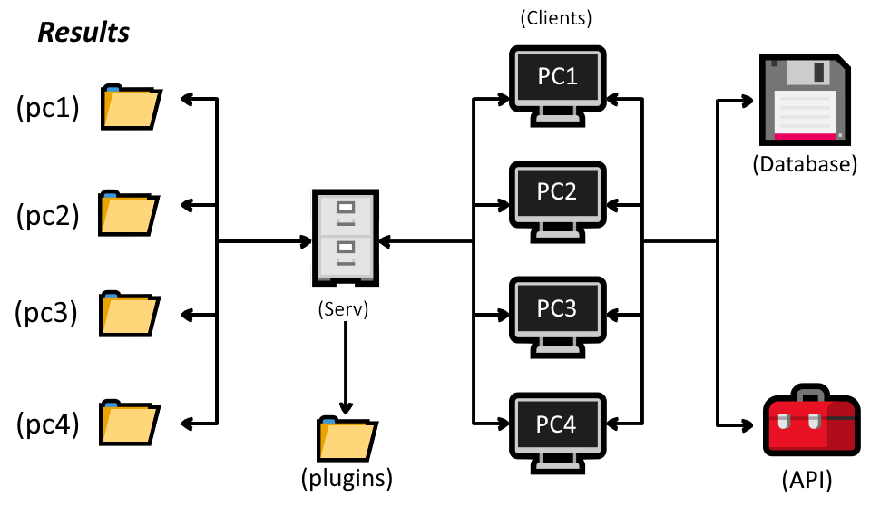

# HAL


Contents
--------

- [Intro](#intro)
- [Installation](#installation)
- [Write your own plugin](#write-your-own-plugin)
- [Add another file extension](#add-another-file-extension)

Intro
------------

HAL est un projet de supervision destiné à récupérer différents donnés d'un parc informatique et à les envoyer sur un serveur, dans le but d'agréger les données en vue des traitres.
Il utilise un système de plugins, qui sont chargés automatiquement au démarrage du client. Plusieurs langages pour écrire les plugins sont supportés:
* C/C++/Go/C# (.dll / .so)
* Python (.py)
* Ruby (.rb)
* Shell (.sh)
* Powershell (.ps1)

Et d'autres peuvent être ajoutés manuellement si besoin.

Les plugins sont déposés dans le dossier "plugins", qui est un dossier spécial scanné permettant de charger automatiquement tous les plugins qui s'y trouvent. 

HAL est destiné à tout utilisateur voulant superviser les ordinateurs sur un réseau.

Installation
------------

Pour le bon fonctionnement de HAL, il faut impérativement avoir 

*  dotnet core 3.x,
*  python3.x
*  ruby

Ou des erreurs peuvent subvenirs pendant l'éxecution des plugins.

XXXXXXXXXXXXXXXX

Write your own plugin
---------------------

### Rédaction d'un plugin

Les informations retournées par le plugin doivent être sous un format JSON.
Pour une efficacité optimal, il convient de normaliser les soties de vos plugins. C'est à dire, respecté une convention de nommage définit selon vos principes.

Chaque plugin doit être mit dans le dossier "plugins" du serveur, qui se chargera de les transmettres aux clients. De plus, une entrée doit être écrite dans le fichier config.json pour avoir les informations nécéssaire au bon déroulement du plugin. 

#### Rédaction d'un plugin avec un langage de script

Toutes les sorties sur l'entrée standard seront sauvegardées par le client.

Un exemple de rédaction d'un plugin (info\_machines.py) pour récupérer diverses informations de la machine en python:

``` python
import platform
import json

osInfo = {
	"machine":platform.machine(),
	"version":platform.version(),
	"platform":platform.platform(),
	"system":platform.system(),
	"processor":platform.processor()
}

print(json.dumps(osInfo));
```

Le fichier de configuratin peut être modifier pour accepter un intepréteur différent de celui par défaut.

``` json
{
	"interpreter": {
		"windows": {
			"python": "<chemin vers python>\python.exe"
		},
		"linux": {
			"python": "/usr/bin/python3",
		},
	},

	"plugins": {
	}
}
```

3 familles de système d'exploitation sont disponibles:
	
* windows (Windows 7, 8, 10...)
* linux (toutes distribution utilisant le noyaux linux)

Il existe aussi la possibilité de configurer une variable d'environnement (en fonction de votre OS), contenant alors le chemin vers l'intepréteur. Il n'est donc pas obligé de modifier le fichier de configuration avec cette méthode.
La variable d'environnement doit avoir comme clé le nom en majuscule (ex: PYTHON, RUBY, POWERSHELL...) et comme valeur le chemin vers l'intepréteur

Exemple sous Linux:

```
PYTHON=/usr/bin/python3
RUBY=/usr/bin/ruby
```

Pour linux, des intepréteurs par défaut sont déjà configurés, il n'est pas alors obligé de les spécifier pour les types de scripts supportés, bien que cela soit très recommandés.

Par la suite, il faut ajouter la configuration du plugin portant le nom et extension (nom.extension) dans la branche "plugins":

* activated (booléen): permet de savoir si le plugin est actif ou non, par conséquent si il doit être executé
* heartbeat (double): 1 execution par heartbeat. Correspond à l'execution périodique d'un plugin où le hearthbeat défini la période.
    * plus le heartbeat est petit, plus nombreux seront les executions par heure, et donc par conséquent une plus grande charge système.
* os (array de string): 
    * optionnel, permet de lancer le plugin uniquement sur un ou plusieurs famille de système d'exploitation
    * si rien n'est spécifié, le plugin sera disponible sur toutes les familles
    * si l'OS cible est linux, une autre option peut être spécifiée:
* admin_rights (booléen): si le script doit être exécuté en administrateur (sudo), si non spécifié, alors false par défaut


Exemple de configuration:

``` json
{
	"interpreter": {
		"windows": {
			"python": "<chemin vers python>\python.exe"
		},
		"linux": {
			"python": "/usr/bin/python3",
		}
	},

	"plugins": {
		"info_machine.py": {
			"activated": "true",
			"heartbeat": "0.5",
			"os": ["windows", "linux"]
		}
	}
}
```

Ce dernier sera alors activé, aura une execution toutes les demie-heure et sera lancé uniquement sur les plateformes windows et linux.

##### Ajout du mode administrateur

Un plugin peut potentiellement avoir besoin d'être éxecuté avec un utilisateur différent que celui actuellement sur la machine.

Pour cela, il faut rajouter mettre "admin\_rights" à "true" et spécifier un utilisateur: "admin_username" avec le nom d'utilisateur.

Exemple:

``` json 
"plugins": {
	"script.sh": {
		"activated": "true",
		"heartbeat": "0.5",
		"admin_rights": "true",
		"admin_username": "user",
		"os": ["linux"]
	}
}
```

Le plugin sera alors lancé automatiquement avec la commande suivant: `sudo -u user -s <shell specifié dans interpreteur> -c script.sh`

#### Rédaction d'un plugin AssemblyDLL, classique DLL, Shared object

##### Exemple en C/C++ (classique DLL, Shared Object)

Un point d'entrée est obligatoire pour l'execution du plugin. Le retour de ce point d'entrée sera alors sauvegardé par le client. Il doit impérativement être en JSON.

``` c
char* run() {

}
```

Exemple d'un code en C (ip\_infos.c) uniquement disponible sur linux (ifaddrs.h) permettant de récupérer le nom de la carte réseau, son addresse et les données.
``` c
#include <ifaddrs.h>
#include <stdio.h>
#include <stdlib.h>

char *run(void) {
	struct ifaddrs* id;
	char* ret = malloc(1024);

	getifaddrs(&id);

	sprintf(ret, "{ \"name\": \"%s\", \"addr\": %d, \"data\": %d}", id->ifa_name, id->ifa_addr, id->ifa_data);
	
	return ret;
}
```

Il faut impérativement que la variable de retour soit allouée en mémoire (via malloc, calloc...)  
Des fonctions peuvent bien sûr être faites pour clarifier le code.

Compilation en .so sous linux:
	`gcc -Wall -Wextra -fPIC -shared ip_infos.c -o ip_infos.so`

Compilation en .dll sous windows (si plugin compatible) avec utilisation de [MinGW](http://www.mingw.org/)
	`gcc -Wall -Wextra -fPIC -shared fichier.c -o fichier.dll`

puis copier ip_infos.so dans le dossier plugins et rajouter une entrée dans config.json:

``` json
 ...
	"plugins": {
	    ...
		"ip\_infos.c.dll": {
			"activated": "true",
			"heartbeat": "0.5",
			"os": ["windows"]
		},
	    "ip_infos.c.so": {
			"activated": "true",
			"heartbeat": "0.5",
			"os": ["linux"]
		}
		...
	}
 ...
```

##### Exemple en C# (AssemblyDLL)

Un point d'entrée est aussi obligatoire pour l'execution du plugin. Le retour du point d'entrée sera alors sauvegardé par le client. Il doit impérativement être en JSON.

``` cs
namespace Plugin 
{
	public class NomPlugin 
	{
	    public string Run() 
	    {

	    }
	}
}
```

Création d'un projet dotnet:

`dotnet new classlib -n plugin`

Modifier Class1.cs pour écrire son plugin
Exemple d'un plugin pour récupérer le nom de la machine:

```cs
using System;

namespace plugin
{
    public class MachineName 
    {
	    public string Run() 
	    {
		    return $"{{\"machinename\": {Environment.MachineName}}}";
	    }
    }
}
```

Puis build la librairie:

`dotnet build`

Finalement, copier et renommer si besoin plugin.dll et le mettre ensuite dans le dossier plugins et ajouter une entrée dans config.json:

``` json
 ...
	"plugins": {
	    ...
		"plugin.dll": {
			"activated": "true",
			"heartbeat": "0.5"
		}
		...
	}
 ...
```

### Exemple en GO

Go génère des dll/so un peu particulier, puisque ces derniers ont obligés d'avoir un main.
Il faut alors utiliser un "export" sur la fonction run pour qu'elle soit appelée par le système de plugin.

La fonction run doit être compatible C, donc il faut utiliser les types de retour en C (char *).

Exemple d'un plugin renvoyant "Hello World!"

``` go
package main

import "C"

func main() {
}

//export run
func run() *C.char {
	return C.CString("Hello World!")
}
```

Pour créer le .so/.dll: `go build -o helloworld.dll -buildmode=c-shared`

### Vérifier que les plugins ont une sortie JSON correcte

Un outil a été crée dans le but de vérifier si une collection de plugins renvoient un json valide.
Pour ça, il faut se rendre dans "plugins_checker" et modifier le fichier "config.json" pour mettre un ou plusieurs chemins de là où se trouve les plugins et le fichier de configuration de ces derniers.

Il faut impérativement suivre ce schéma:
* dossier
    * config.json
    * plugins
        * nomplugin1...
        * nomplugin2...
        * nomplugin3...
            ...

Example:
Un dossier "test1" contient:
* config.json
* plugins/
    * cpu_temperature.py
    * kernel_version.sh
        

et un autre dossier, test2, contient quand à lui:
* config.json
* plugins/
    * connected_user.sh
    * os_informations.rb

Il faut alors tout simplement modifier le fichier "config.json" de plugins_checker comme suit:

``` json
{
  "paths": [
    "chemin/vers/test1",
    "chemin/vers/test2"
  ]
}
```
Puis finalement executer le programme.


Démonstration avec les plugins dans client et client/examples
<a href="https://asciinema.org/a/J80BBg2GtqJgNCegzcDFCqgkW"></a>

L'erreur: "Error reading JToken from JsonReader. Path '', line 0, position 0."
peut signifier plusieurs choses:
*  un intépreteur par défaut n'est pas installer, il faut vérifier si ruby, python3 et bash sont bien installés sur la machine
*  le retour n'est pas du format json

Add another file extension
---------------------

Pour ajouter une extension personnalisée, il suffit d'ajouter "custom_extensions" dans le fichier de configuration.
Par exemple, pour ajouter une extension de PHP (.php):

``` json
{
  "custom_extensions": {
  	".php": "php"
  }
  "interpreter": {
	"linux": {
	  "php": "path/to/php"
	}
	...
  },

  "plugins": {
	...
  }
}
```

Ne surtout pas oublier de rajouter un intépréteur, car aucun n'a été défini par défaut, que ce soit via config.json ou les variables d'environnements.

### Schema récapitulatif du projet

