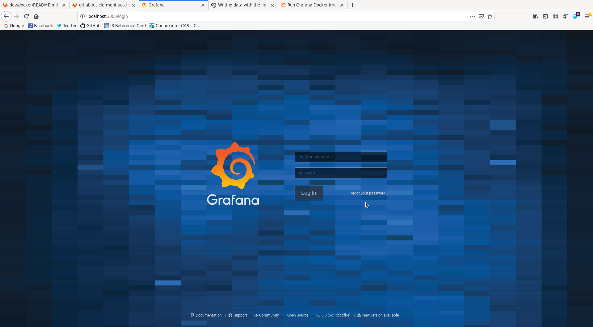
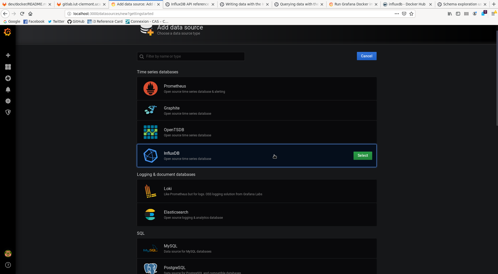
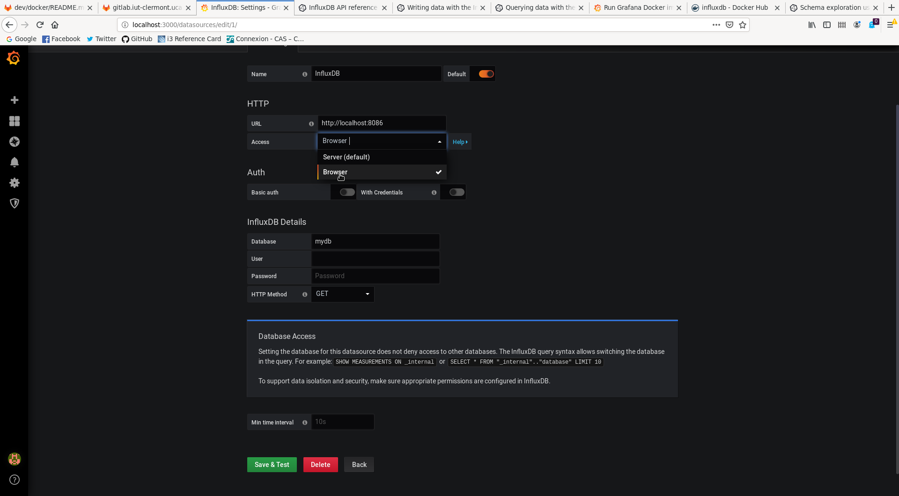
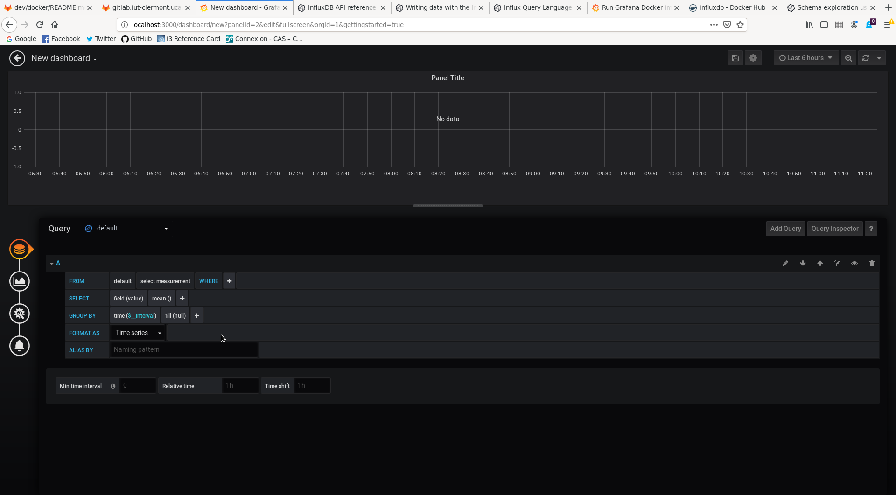
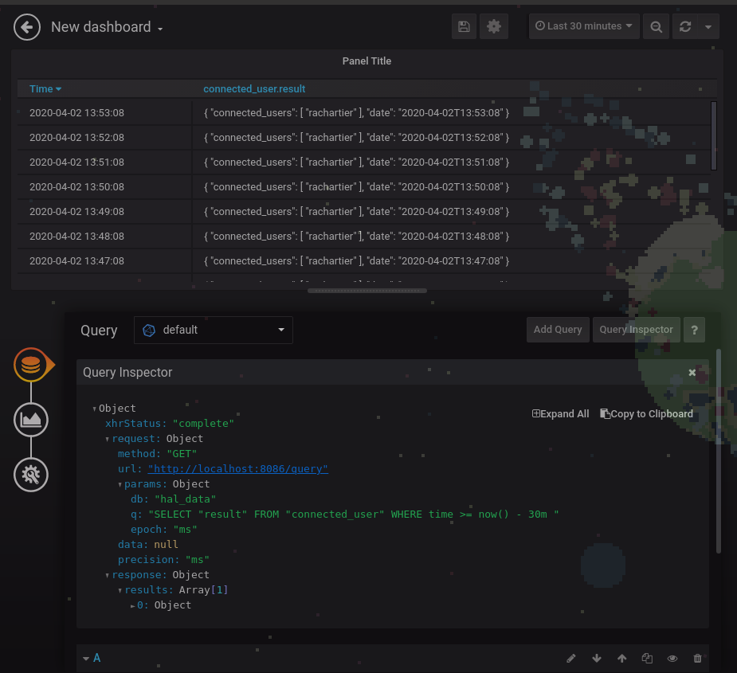

***Retrouvez tout les éléments de documentation dans la partie [documentation](documents/) du projet***

Contents
--------

- [Intro](#intro)
	- [Prérequis](#prérequis)
	- [QuickStart](#quickstart)
		- [Utilisation du serveur avec Docker](#utilisation-du-serveur-avec-docker)
- [Choix Installations](#choix-installations)
	- [Serveur](#serveur)
		- [Docker](#docker)
			- [Exigence](#exigence)
			- [Installation avec Docker](#installation-avec-docker)
		- [Installation Manuelle](#installation-manuelle)
			- [Installation](#installation)
	- [Client](#client)
		- [Installation Manuelle](#installation-manuelle-1)
- [Serveur Docker Documentation](#serveur-docker-documentation)
	- [Docker-Compose du serveur](#docker-compose-du-serveur)
		- [Volumes du serveur](#volumes-du-serveur)
		- [Variables d'environnement](#variables-denvironnement)
	- [Mise à jour du Docker](#mise-à-jour-du-docker)
	- [InfluxDB](#influxdb)
		- [Présentation](#présentation)
		- [Installation InfluxDB](#installation-influxdb)
		- [Volumes InfluxDB](#volumes-influxdb)
		- [InfluxDB API](#influxdb-api)
		- [InfluxQL](#influxql)
		- [Liaison avec HAL](#liaison-avec-hal)
	- [Grafana](#grafana)
		- [Présentation Grafana](#présentation-grafana)
		- [Installation Grafana](#installation-grafana)
		- [Volumes Grafana](#volumes-grafana)
		- [Présentation rapide de l'interface](#présentation-rapide-de-linterface)
			- [Data Source](#data-source)
		- [Grafana et InfluxQL](#grafana-et-influxql)
	- [Tout-en-un](#tout-en-un)
- [Serveur Installation Manuelle](#serveur-installation-manuelle)
	- [Installation Manuelle Linux](#installation-manuelle-linux)
	- [Installation Manuelle Windows](#installation-manuelle-windows)
- [Client Installation](#client-installation)
	- [Installation Manuelle Linux](#installation-manuelle-linux-1)
	- [Installation Manuelle Windows](#installation-manuelle-windows-1)
	- [Configuration](#configuration)
		- [Comprendre `config.json` et `config_local.json`](#comprendre-configjson-et-config_localjson)
		- [Configurer le serveur pour le client](#configurer-le-serveur-pour-le-client)
			- [Changement d'ip et de port](#changement-dip-et-de-port)
		- [Configurer le serveur](#configurer-le-serveur)
		- [Configurer le client](#configurer-le-client)
			- [Attributs](#attributs)
			- [Mode administrateur](#mode-administrateur)
			- [Mode differencial](#mode-differencial)
	- [Configuration des clients par le serveur](#configuration-des-clients-par-le-serveur)
	- [Rédaction plugins](#rédaction-plugins)
		- [Difference entre AssemblyDLL, DLL classique, shared object et script](#difference-entre-assemblydll-dll-classique-shared-object-et-script)
		- [Rédaction de plugins via langages supportés par défaut](#rédaction-de-plugins-via-langages-supportés-par-défaut)
			- [Exemple en C/C++ (DLL classique, Shared Object)](#exemple-en-cc-dll-classique-shared-object)
			- [Exemple en C# (AssemblyDLL)](#exemple-en-c-assemblydll)
			- [Exemple en GO (Script / DLL classique)](#exemple-en-go-script--dll-classique)
			- [Exemple en Python (Script)](#exemple-en-python-script)
		- [Via langage non supporté par défaut (ET scripts Windows)](#vialangagenonsupportépardéfaut-et-scripts-windows)
			- [Ajout d'un interpreteur via fichier de configuration](#ajoutduninterpreteur-via-fichier-de-configuration)
			- [Ajout d'une extension de plugin personnalisée](#ajout-dune-extension-de-plugin-personnalisée)
			- [Ajout d'in interpreteur via variables d'environnements](#ajout-din-interpreteur-via-variables-denvironnements)
	- [Vérification des sorties des plugins](#vérificationdessortiesdesplugins)
		- [Présentation du plugins_checker](#présentationduplugins_checker)
	- [Configurer les sauvegardes des résultats](#configurer-les-sauvegardes-des-résultats)

# Intro

HAL est un projet de supervision destiné à récupérer différents donnés d'un parc informatique et à les envoyer sur un serveur, dans le but d'agréger les données en vue des traiter.
Il utilise un système de plugins, qui sont chargés automatiquement au démarrage du client. Plusieurs langages pour écrire les plugins sont supportés:
* C/C++/C#/Go (.dll / .so)
* Go Script (.go)
* Python (.py)
* Ruby (.rb)
* Shell (.sh)
* Powershell (.ps1)

Et d'autres peuvent être ajoutés manuellement si besoin.

Les plugins sont déposés dans le dossier "plugins", qui est un dossier spécial scanné permettant de charger automatiquement tous les plugins qui s'y trouvent. 

HAL est destiné à tout utilisateur voulant superviser les ordinateurs sur un réseau.

Prérequis
------------

Pour le bon fonctionnement de HAL, il faut impérativement avoir 

*  [.NET Core 3.x](https://dotnet.microsoft.com/), (serveur/client)
*  [Python 3.x](https://www.python.org/downloads/) (client, si vous souhaitez utiliser des plugins en python)
*  [Ruby](https://www.ruby-lang.org/fr/downloads/) (client, si vous souhaitez utiliser des plugins en ruby)
*  [Go](https://golang.org/) (client, si vous souhaitez utiliser des plugins en go)

Ou des erreurs peuvent subvenir pendant l'éxecution des plugins.


QuickStart
---------------------

### Utilisation du serveur avec Docker

1. Télécharger la dernière image docker du serveur [dockerhub.iut-clermont.uca.fr](https://dockerhub.iut-clermont.uca.fr/ui/library/hal_hal-server_dotnet3.1)

`docker pull dockerhub.iut-clermont.uca.fr:443/hal_hal-server_dotnet3.1:latest`

2. Télécharger le [docker-compose](/dev/docker/server) par défaut du serveur

3. Lancer le docker-compose
`docker-compose up \chemin du docker-compose du serveur\`
NB: Si vous n'avez pas installé docker-compose suivez ce lien [docs.docker.com](https://docs.docker.com/compose/install/)

Pour plus d'information concernant le docker-compose et sa configuration, référez vous au [README](dev/docker) du dossier docker du projet.

Une fois le serveur lancé vous pouvez commencer à utilisé le serveur HAL. Par défaut le port de connexion de HAL est le port 11000 et l'IP par défaut et l'IP local.

Vous pouvez maintenant commencer à écrire vos propres plugins afin de les transférer aux clients.

# Choix Installations

Plusieurs possibilités existe afin d'installer le serveur et le client HAL. Nous recommandons toujours quant c'est possible, l'installation Docker.

## Serveur

### Docker

L'installation Docker du serveur est l'installation recommandé.

Le serveur peut être utilisé via un conteneur Docker disponible sur [dockerhub.iut-clermont.uca.fr/ui/library/hal\_hal-server\_dotnet3.1](https://dockerhub.iut-clermont.uca.fr/ui/library/hal_hal-server_dotnet3.1).
Pour plus d'informations se référer au [README](dev/docker) disponible dans le dossier dev/docker/

Si vous souhaiter utiliser le serveur avec grafana et influxdb il faudra alors utiliser le docker-compose approprié, lien vers la [documentation](dev/docker/influxdb-grafana-hal-server)

#### Exigence

Afin d'installer correctement le serveur vous devrez avoir:

* [Docker](https://docs.docker.com/engine/install/) (v19.0 min)
* [Docker-Compose](https://docs.docker.com/compose/install/) 

#### Installation avec Docker

L'image docker du serveur est présente sur le docker hub de l'IUT: [https://dockerhub.iut-clermont.uca.fr/ui/library/hal_hal-server_dotnet3.1](https://dockerhub.iut-clermont.uca.fr/ui/library/hal_hal-server_dotnet3.1)

Pour plus d'information sur l'installation du docker du serveur se référer à cette [documentation](#docker-compose-du-serveur).

### Installation Manuelle

L'installation manuelle du serveur est possible de plusieurs façon, soit avec un service/daemon ou bien manuellement et non-automatique.

#### Installation 

Des dossiers sont fournis dans l'onglet release du projet Git, dans ces dossiers zippé on retrouve l'exécutable du serveur, sous linux il suffira de lancer en ligne de commande le serveur avec la commande `./server` (si vous lancez la commande dans le même dossier) ou bien de configurer le daemon fournis dans les dossiers du projet Git (lien vers daemons).

Pour plus d'information se référer à la [documentation](#serveur-installation-manuelle) un peu plus bas.

## Client

Pas d'installation docker disponible pour le Docker pour le moment, nous n'avons pas trouvé ça utile de fournir un lancement conteneurisé pour le client.
Uniquement une installation manuelle est fournis dans la documentation.

### Installation Manuelle

Comme pour le serveur, le dossier zippé du client sera disponible dans l'onglet release du projet Git, dedans on retrouvera l'exécutable du client, sous linux il suffire de lancer en ligne de commande le serveur avec la commande `./client` (si vous lancez la commande dans le même dossier) ou bien de configurer le daemon fournis dans les dossiers du projet Git [https://gitlab.iut-clermont.uca.fr/rachartier/hal/-/tree/master/dev/daemon](https://gitlab.iut-clermont.uca.fr/rachartier/hal/-/tree/master/dev/daemon).

Pour plus d'information se référer à la [documentation](#client-installation) un peu plus bas.


# Serveur Docker Documentation

## Docker-Compose du serveur

Le docker-compose de l'application actuelle est disponible sur [/docker/server/docker-compose.yml](/docker/server/docker-compose.yml).

Le container du serveur, quant à lui, est disponible en publique sur [dockerhub.iut-clermont.uca.fr/ui/library/hal_hal-server_dotnet3.1](https://dockerhub.iut-clermont.uca.fr/ui/library/hal_hal-server_dotnet3.1).

La configuration du docker-compose est comme suit:

```yaml
version: "3.3"
services:
  hal:
    image: dockerhub.iut-clermont.uca.fr:443/hal_hal-server_dotnet3.1:latest
    ports:
      - "11000:11000"
    restart: unless-stopped
    volumes:
          - /data/TMP/hal/results:/data
          - /data/TMP/hal/plugins:/plugins
    environment:
      IP_HAL: "0.0.0.0"
      PORT_HAL: 11000
      MAX_THREADS_HAL: 8
      UPDATE_RATE_HAL: 1000
      SAVE_PATH_HAL: /data
```

### Volumes du serveur

Côté **hôte**, on a deux volumes: `/data/TMP/hal/results` qui correspond au dossier contenant les résultats des plugins exécuté dans les clients de HAL. Vous pouvez le changer comme vous le voulez, cependant le volume côté **conteneur** ne devra pas changer `/data`.

Le second volume: `/data/TMP/hal/plugins` correspond au dossier contenant les plugins à envoyer aux clients de HAL. Vous pouvez également le changer comme vous le voulez, cependant le volume côté **conteneur** ne devra pas être changer `/plugins`.

### Variables d'environnement

Le docker-compose est composé de variables d'environnement, ces variables servent à modifier la configuration du serveur:

- IP_HAL: La variable d'environnement indiquant l'adresse IP du serveur.
- PORT_HAL: La variable d'environnement qui indique le port ou le serveur iras pointer pour les clients et la communication. **/!\ Si cette variables est changé, ne pas oublier de modifier également le port du conteneur dans le docker-compose.yml (champs 'ports' du docker-compose ci-dessus) /!\\**
- MAX_THREADS_HAL: La variable d'environnement qui indique le nombre max de threads utilisé par le serveur HAL.
- UPDATE_RATE_HAL: La variable d'environnement qui indique la fréquence des updates en millisecondes.
- SAVE_PATH_HAL: C'est le chemin où seront sauvegarder les données récoltés par les plugins dans le container du serveur HAL.

## Mise à jour du Docker

Pour mettre à jour le conteneur, il suffit simplement de se placer dans le même dossier que le docker-compose.yml du serveur est de rentrer cette commande: `docker-compose pull`. Cela mettra à jour automatiquement l'image présente dans le docker-compose.yml du dossier ou vous vous trouver.

Ici il mettra à jour l'image: `dockerhub.iut-clermont.uca.fr:443/hal_hal-server_dotnet3.1:latest`

Et pour lancer le serveur via le docker-compose, il suffit de lancer `docker-compose up` ou `docker-compose up -d` pour un lancement en mode démon.

## InfluxDB

InfluxDB est système de gestion de base de donnée orientée données dite 'timeseries', c'est-à-dire qu'il s'agit de base de donnée contenant des données horodatée. Il possède une gestion haute performance et une API permettant de faire des requêtes de donnée au sein même des bases, et ceux grâce à leur langage de requête nommé InfluxQL.

### Présentation

InfluxDB est l'une des solutions proposé pour stocker les données de récoltées par HAL, voir la documentation sur les [stockages](/tree/master/#stockage). Notre documentation fournis un ensemble 'ready to go' permettant de lancer le serveur HAL avec Grafana et InfluxDB connecté.

### Installation InfluxDB

Nous n'avons pas fournis de solution d'installation manuelle pour InfluxDB. Ni même de docker-compose indépendant. Cependant vous pouvez créer votre propre docker-compose indépendant pour votre influxDB si vous souhaitez l'installer sur un serveur distant.

Le service d'influxdb au sein du docker-compose se résume comme suit:

```yaml
  influxdb:
    image: influxdb:latest
    restart: unless-stopped
    ports:
      - "8083:8083"
      - "8086:8086"
      - "8090:8090"
    env_file:
      - 'env.influxdb'
    volumes:
      # Data persistency
      # sudo mkdir -p /srv/docker/influxdb/data
      - /srv/docker/influxdb/data:/var/lib/influxdb
```

Le port 8083 d'influxDB correspond à l'interface web administrateur, vous pouvez bien sur redirigé le port hôte vers un autre port souhaité.
Le port 8086 d'influxDB correspond à l'API exposé en HTTP, c'est ce port qui sera utilisé par Grafana afin d'accéder aux données.

NB: Si le conteneur d'influxDB est situé dans le même docker-compose que celui de Grafana, il n'est pas obligatoire d'exposé l'API afin que tout fonctionne correctement, cependant de cette manière vous ne pourrez pas débugger depuis l'extérieur du réseaux interne du docker-compose.

Pour une installation manuelle de InfluxDB, la [documentation](https://docs.influxdata.com/influxdb/v1.8/introduction/install/) d'influxDB est très bien faite et pourras vous aidez à déployer la solution souhaité.

### Volumes InfluxDB

Vous devrez monter un volume sur votre hôte si vous voulez accéder aux données persisté dans le conteneur.

```yaml
    volumes:
      # Data persistency
      # sudo mkdir -p /srv/docker/influxdb/data
      - /srv/docker/influxdb/data:/var/lib/influxdb
```

Par défaut le chemin vers les données persistés côté hôte est: `/srv/docker/influxdb/data` créé le avec la commande `sudo mkdir -p /srv/docker/influxdb/data`.

Plus d'information sur les spécificités du conteneur influxdb sur [la documentation officielle](https://hub.docker.com/_/influxdb).

### InfluxDB API

L'API d'influxDB est essentiel pour la compréhension de Grafana par la suite. En effet, Grafana se servira de cette API afin de communiquer avec la base, il est donc important d'en comprendre les principes.

Pour pouvoir regarder toute les bases de données disponible au sein de la base influxDB: `curl -G http://localhost:8086/query --data-urlencode "q=SHOW DATABASES"`

Bien sur `localhost` est à remplacé par l'adresse de votre serveur influxDB qu'il soit conteneurisé ou non.

Pour créer une base de donnée: `curl -i -XPOST http://localhost:8086/query --data-urlencode "q=CREATE DATABASE hal_data"`

On peut également créer des données à ajouter directement dans les bases que l'on vient de créer, et tout ça en ligne de commande grâce à l'API disponible de InfluxDB:
`curl -i -XPOST 'http://localhost:8086/write?db=hal_data' --data-binary 'cpu_load_short,host=server01,region=us-west value=0.64 1434055562000000000'`

Ici on ajoute une valeur à la colonne `cpu_load_short` dans la base `hal_data` créée précédemment.

Pour plus d'information concernant le endpoint `/write`, la documentation se trouve [ici](https://docs.influxdata.com/influxdb/v1.7/tools/api/#write-http-endpoint)

[Ici](https://docs.influxdata.com/influxdb/v1.8/guides/write_data/) vous pouvez retrouver de la documentation et un guide sur l'écriture des données dans les bases de InfluxDB.

Si vous voulez tester HAL en utilisant Grafana et InfluxDB avec l'aide de l'API vous devrez:

- Créer la bdd `hal_data` (`curl -i -XPOST http://localhost:8086/query --data-urlencode "q=CREATE DATABASE hal_data"`)
- Vérifier qu'elle est bien été ajouté (`curl -G http://localhost:8086/query --data-urlencode "q=SHOW DATABASES"`)

### InfluxQL

La documentation officielle du langage créé par InfluxDB se trouve [ici](https://docs.influxdata.com/influxdb/v1.8/query_language/).

Si on reprend notre exemple, avec l'API précédemment montré nous avons déjà utiliser du InfluxQL. Donc de cette même manière nous pouvons faire des requêtes sur la base comme ceci:

`curl -G "http://localhost:8086/query?pretty=true" --data-urlencode "db=hal_data" --data-urlencode "q=SELECT "result" FROM "connected_user" WHERE time >= now() - 30m"`

Ce qui nous renverras la colonne 'result' de 'connected_user' dans la base 'hal_data' créé précédemment.

Par la suite nous pourrons voir l'utilisation d'influxQL avec Grafana.

### Liaison avec HAL

Les clients de HAL devront pousser les données dans la base de donnée voulu de InfluxDB.

Afin de lier InfluxDB avec HAL il vous faudra modifié le fichier `config_local.json` du côté du serveur:

```yaml
{
  "server": {
    "ip": "127.0.0.1",
    "port": 11000
  },

  "storage": [
    "influxdb"
  ],

  "database": {
    "connectionString": [
        "http://localhost:8086/"
    ]
  }
}
```

Pour plus d'information sur `config_local.json` veuillez vous réferer à "[Comprendre `config.json` et `config_local.json`](#comprendre-configjson-et-config_localjson)"

## Grafana

Grafana est un logiciel libre qui permet la visualisation des données. On peut y effectuer des tableaux de bords avancés et également avoir un système d'alerte au sein même de ceux-ci. Il possède aussi une gestion des droits fines pouvant être configuré aisement via son interface web. Il peut être utilisé avec plusieurs Base de donnée mais surtout avec des BDD horodatée comme InfluxDB.

### Présentation Grafana

Grafana est une solution retenue afin d'obtenir une metrologie plus poussé de HAL, il permet d'éffectuer des requêtes à InfluxDB et de pouvoir agencer des tableaux de bords simple d'utilisation. Cependant il faudra avoir une connaissance du langage [InfluxQL](#influxql). Notre documentation fournis un ensemble 'ready to go' permettant de lancer le serveur HAL avec Grafana et InfluxDB connecté.

### Installation Grafana

Nous n'avons pas fournis de solution d'installation manuelle pour Grafana. Ni même de docker-compose indépendant. Cependant vous pouvez créer votre propre docker-compose indépendant pour votre Grafana si vous souhaitez l'installer sur un serveur distant.

/!\ Cependant gardé en tête que la documentation s'appuie sur le fait que les conteneurs sont situé dans le même réseau, si vous souhaitez faire des instances séparées de chacun vous devrez adapté certains éléments de la documentation à votre propre projet /!\

Le service de grafana au sein du docker-compose se résume comme suit:

```yaml
  grafana:
    image: grafana/grafana:latest
    restart: unless-stopped
    ports:
      - "3000:3000"
    user: "0"
    links:
      - influxdb
    volumes:
      # Data persistency
      # sudo mkdir -p /srv/docker/grafana/data; chown 472:472 /srv/docker/grafana/data
      - /srv/docker/grafana/data:/var/lib/grafana
```

Le port 3000 de Grafana correspond à l'interface web.

S'ils se trouvent dans le même docker-compose, grafana est lié au lancement du service influxDB (cette partie est optionnelle si docker-compose différent).

### Volumes Grafana

Vous devrez monter un volume sur votre hôte si vous voulez accèder aux données persisté dans le conteneur.

```yaml
    volumes:
      # Data persistency
      # sudo mkdir -p /srv/docker/grafana/data; chown 472:472 /srv/docker/grafana/data
      - /srv/docker/grafana/data:/var/lib/grafana
```

Créé le volume côté hôte, par défaut le chemin de l'hôte est `/srv/docker/grafana/data`, créé le avec la commande `sudo mkdir -p /srv/docker/grafana/data` puis changé le propriétaire du dossier en 472 avec la commande `chown 472:472 /srv/docker/grafana/data`. 472 est l'utilisateur par défaut dans les versions de grafana >=5.1 (en dessous l'utilisateur par défaut est le 104).

Plus d'information sur la documentation officielle du [docker grafana](https://grafana.com/docs/grafana/latest/installation/docker/).

### Présentation rapide de l'interface



Voici la page de login, par défaut il existe un utilisateur admin avec le mot de passe admin.

Par la suite Grafana vous redirigeras vers la page principale, ou tout le processus pour un bon début y est présenté. La première étape à faire et de configurer le **Data Source** et de le configurer sur la base influxdb de votre conteneur.

#### Data Source



Selectionné InfluxDB



En fonction de votre configuration du docker-compose, vous pourrez soit passer par un accès Navigateur (Browser) ou Serveur par défaut. Plus d'information sur comment configurer votre data source Grafana vers InfluxDB sur la [documentation officielle](https://grafana.com/docs/grafana/latest/features/datasources/influxdb/)

Ce qu'il y a à retenir pour l'accès c'est si vous mettez Server=l'URL doit être accessible depuis le serveur de Grafana; et si vous mettez Browser=l'URL doit être accessible via le navigateur.

L'URL renseigné dépend donc de votre configuration du docker-compose, cependant s'il est équivalent au notre et que l'influxDB se situe dans le même réseaux que le grafana alors l'url sera -> http://localhost:8086

**InfluxDB Details** dépend la aussi de votre configuration précédente, ici le nom de la base de donné sera celle par défaut, càd `hal_data`.

### Grafana et InfluxQL

Maintenant que tout est configuré il ne reste plus qu'a découvrir l'interface de requetage de Grafana !



On peut maintenant créer une créer une première vue et exposé les données dans un petit tableau dans grafana:



Ici on utilise les résultats du plugins **connected_users**, et bien sur la requête exposé est équivalente à l'appel API : `curl -G "http://localhost:8086/query?pretty=true" --data-urlencode "db=hal_data" --data-urlencode "q=SELECT "result" FROM "connected_user" WHERE time >= now() - 30m"`

## Tout-en-un 

Un docker-compose est disponible afin d'utiliser l'ensemble des solutions avec le serveur HAL; soit Grafana, influxDB et HAL.
La documentation de [Grafana](#grafana) et [influxDB](#influxdb) servent à comprendre comment grafana et influxdb fonctionne au sein du docker-compose. Il suffit de rajouter le serveur HAL afin de le lié à la base et à grafana. Le docker-compose est déjà disponible au sein du projet.

Voici le processus pour tester l'ensemble en **local** par exemple :

- Enlever HAL SERVER du docker-compose (seulement si le test est en local !) et le lancer manuellement.
- Écrire la bonne configuration pour la base de donnée influxdb dans le config_local.json
- Créer la base de donnée 'hal_data' (`curl -i -XPOST http://localhost:8086/query --data-urlencode "q=CREATE DATABASE hal_data"`)
- Vérifier que la base ai bien été crée (`curl -G http://localhost:8086/query --data-urlencode "q=SHOW DATABASES"`)
- Se connecter à Grafana sur 'localhost:3000' en utilisant l'utilisateur administrateur
- Interroger la base avec de l'InfluxQL depuis Grafana
- Crée vos propres dashboard
  
# Serveur Installation Manuelle

Plusieurs façons existe afin de lancer manuellement le serveur, bien qu'il soit recommandé de l'utiliser via Docker.

## Installation Manuelle Linux

Il existe un service init.d pour le serveur disponible dans les fichiers du projets.

```yaml
[Unit]
Description=HAL server daemon
After=network-online.target

[Service]
Type=simple
User=hal-server
Group=hal-server
ExecStart=

[Install]
WantedBy=multi-user.target
```

Vous pourrez le modifier à votre guise selon votre utilisation, vous devrez préciser le chemin de l'exécutable via `ExecStart`. Dans le chemin vous devrez exécuter le fichier `server` dans le zip fournis dans la release. Vous préciserez le chemin de la ou vous avez placé le dossier.

Nous vous recommandons de mettre le dossier dans un dossier inaccessible par les utilisateurs et de créer un utilisateur particulier, ici `hal-server`.

Pour lancer le serveur sous linux la commande est `./server`.

## Installation Manuelle Windows

Pour l'installation manuelle windows, même chose à l'exception que pour le moment nous n'avons pas fournis de service Windows (.ini) pour un lancement automatique du service. Vous pouvez cependant le créer pour vous dans la même architecture que le init.d fournis précédemment. 

Un dossier .zip est fournis dans l'onglet release du Github, dedans vous trouverez un exécutable pour windows et vous pourrez le lancer de la même manière que précédemment ou bien en double cliquant dessus simplement.

# Client Installation

La seule façon existante d'installer le client et de l'installer manuellement.

## Installation Manuelle Linux

Comme pour le serveur, un daemon init.d est disponible:

```yaml
[Unit]
Description=HAL client daemon
After=network-online.target

[Service]
Type=simple
User=hal-client
Group=hal-client
ExecStart=

[Install]
WantedBy=multi-user.target
```

Vous pouvez le modifier à votre guise, vous devrez spécifié le chemin d'installation que vous aurez choisis pour le client. Vous devrez exécuté l'exécutable `client` présent dans le zip fournis dans l'onglet release du Github.

Nous vous recommandons de mettre le dossier dans un dossier inaccessible par les utilisateurs et de créer un utilisateur particulier, ici `hal-client`.


Pour lancer le client sous linux la commande est `./client`.

## Installation Manuelle Windows

Pour l'installation manuelle windows, même chose à l'exception que pour le moment nous n'avons pas fournis de service Windows (.ini) pour un lancement automatique du service. Vous pouvez cependant le créer pour vous dans la même architecture que le init.d fournis précédemment. 

Un dossier .zip est fournis dans l'onglet release du Github, dedans vous trouverez un exécutable pour windows et vous pourrez le lancer de la même manière que précédemment ou bien en double cliquant dessus simplement.

Configuration
-------------
### Comprendre `config.json` et `config_local.json` 

2 types de fichiers de configurations sont présents:
*  config\_local.json
*  config\_global.json

`config_local.json`: sert uniquement à rajouter des configurations de plugin. Il est déposé en local dans le dossier "config" sur les *clients*, et ne sera en aucun cas supprimé ou modifié par le serveur.

`config.json`: sert à modifier tout ce qui est possible dans HAL. Tout est détaillé plus bas dans la documentation. Ce fichier sera distribué à tous les clients et par la suite mis à jour via le serveur.

Il sera impératif de rédiger son propre `config.json`, et de l'ajouter dans le dossier "plugins" du serveur.

### Configurer le serveur pour le client
#### Changement d'ip et de port

Pour régler la connexion au serveur d'un client, il faut ajouter dans le fichier `config_local.json`, présent sur les clients :

```json
{
	"server": {
		"ip": "<ip du serveur>",
		"port": <port du serveur>
	}
}
```

- `ip`: l'ip d'un des serveurs HAL
- `port`: port d'un des serveurs HAL, par défaut `11000`

**Exemple d'un `config.json` (\<dossier du serveur\>/plugins/config.json)**:

```json
{
  "storage": [
      "server"
  ],

  "plugins": {
    "upgrades_available.sh": {
      "activated": "true",
      "os": [
        "linux"
      ],
      "heartbeat": 0.010
    },
    "kernel_version.py": {
      "activated": "true",
      "heartbeat": 0.010,
      "differencial_all": true
    },
    "connected_user.py": {
      "activated": "true",
      "heartbeat": 0.010,
      "differencial": [
        "connected_user"
      ]
    }
  }
}
```

**Exemple d'un `config_local.json` (\<dossier du client\>/config/config_local.json)**:
```json 
{
  "server": {
    "ip": "XX.XX.XX.XX",
    "port": 11000
  }
}
```

### Configurer le serveur

La configuration du serveur se fait dans le fichier `config.json` présent dans la racine du serveur

| Nom         | Optionnel |  Type  | Signification                                                                                                                                                                                                     |
| ----------- | :-------: | :----: | ----------------------------------------------------------------------------------------------------------------------------------------------------------------------------------------------------------------- |
| ip          |           | string | l'ip sur lequel le serveur tourne                                                                                                                                                                                 |
| port        |           |  uint  | le porte sur lequel le serveur tourne (à eviter de modifier)                                                                                                                                                      |
| max_threads |           |  uint  | le nombre maximum de threads que le serveur peut utiliser. Plus de threads équivaut à plus de traitement rapidement. Pour de 0 - 200 clients nous recommandons 2, pour 200 - 3000: 4, 3000 - 6000: 8, +6000: 8-16 |
| update_rate |           |  uint  | période en milliseconde à laquelle le serveur va scanner son dossier plugin pour envoyer les modifications aux clients                                                                                            |
| save_path   |           | string | chemin pour lequel sera sauvegardé les résultats des plugins si le paramètre "server" est indiqué dans les clients                                                                                                |

Exemple d'un fichier `config.json`:

```json
{
  "ip": "127.0.0.1",
  "port": 11000,
  "max_threads": 8,
  "update_rate": 1000,
  "save_path": "/tmp/hal_save"
}
```

### Configurer le client

La configuration du client peut se faire dans le fichier `config.json`, présent dans le dossier "plugins" du serveur, ce qui permettra de facilement ajouter, supprimer, modifier la configuration de tous les clients sans problème.

Si besoin, un client peut avoir d'autres plugins en plus, pour cela, il faut les ajouter dans `config_local.json`.


#### Attributs

| Nom              | Optionnel |   Type   | Signification                                                                                                                                                                   |
| ---------------- | :-------: | :------: | ------------------------------------------------------------------------------------------------------------------------------------------------------------------------------- |
| activated        |           |   bool   | le plugin est activé si `"true"`, desactivé si `"false"`                                                                                                                        |
| heartbeat        |           |   uint   | fréquence d'éxecution du plugin, 1 heartbeat = 1 execution par minute, 2 = 2 par minute ...                                                                                     |
| os               |     X     | string[] | sur quel système d'exploitation sera executé le plugin. Valeurs possible: `"linux"`, `"windows"`, `"linux","windows"`. Si non spécifié, le plugin sera executé sur tout les OS. |
| admin_rights     |     X     |   bool   | execute le plugin en mode administrateur si `"true"`, mode utilisateur si `"false"`                                                                                             |
| admin_username   |     X     |  string  | si admin_rights est activé, lance le plugin en mode administrateur avec l'utilisateur spécifié                                                                                  |
| differencial_all |     X     |   bool   | vérifie si le résultat json du plugin est différent de l'ancien pour TOUT ses attributs. Si tout les résultats des attributs sont identiques, alors le retour est ignoré        |
| differencial     |     X     | string[] | vérifie si le résultat json du plugin est différent de l'ancien pour les attributs . Si tout les résultats des attributs explicités sont identiques, alors le retour est ignoré |

**Exemple (config local/serveur)**:

```json 
{
  "plugins": {
    "upgrades_available.sh": {
      "activated": "true",
      "os": [
        "linux"
      ],
      "heartbeat": 0.010
    },
    "kernel_version.py": {
      "activated": "true",
      "heartbeat": 0.010,
      "differencial_all": true
    },
    "connected_user.py": {
      "activated": "true",
      "heartbeat": 0.010,
      "differencial": [
        "connected_user"
      ]
    },
	"do_upgrades.sh": {
      "activated": "true",
      "os": [
        "linux"
      ],
      "heartbeat": 0.001,
	  "admin_rights": "true",
	  "admin_username": "usr_do_upgrades"
	}
  }
}
```

#### Mode administrateur

Le mode administrateur fonctionne sur Windows et Linux. Il permet d'éxecuter un plugin avec les droits supplémentaires offerts par le système d'exploitation.
Un utilisateur doit être assigné, car l'execution d'un plugin en mode administrateur doit se faire sans mot de passe, pour des raisons de sécurité.

Il faut être très vigileant en utilisant le mode administrateur, car les plugins font exactement ce qu'on leur demande de faire, et une erreur peut être vite arrivé.

Nous conseillons de l'utiliser en dernier recours et de bien avoir fait les tests nécessaires avant de le mettre en production.

#### Mode differencial

Le mode differencial permet d'économiser de l'espace disque et de l'utilisation réseau.

En effet, pour un plugin, il se peut que son retour soit très souvent le même. Pour éviter, si besoin, de stocker les répétitions, le mode differencial existe.

Prenons l'exemple d'un plugin qui va renvoyer:
	
- l'utilisateur connecté
- l'heure à laquelle le plugin est executé
- le système d'exploitation

Toutes les 5 minutes.

Exemple d'un retour:

```json
{
	"user": "XXX",
	"date": "2020-05-28T14:00:00.000Z",
	"os": "debian"
}
```

Il est alors interessant de n'avoir l'information qu'uniquement quand un nouvel utilisateur est connecté sur la machine.

Dans les attributs du plugin, il faut alors ajouter le mode differencial sur l'attribut "user" et "os".

Exemple (config local/serveur):
```json
{
	...
	"plugins": {
		...
		"user_info.sh": {
			"activated": "true",
			"heartbeat": 0.2,
			"differencial": [
				"user",
				"os"
			]
		}
		...
	}
	...
}
```

Si, et uniquement si le résultat des attributs "user" OU "os" sont différents, alors le retour sera sauvegardé.

Maintenant, prenons l'exemple d'un plugin qui va renvoyer la liste auto-générée complète des packages installés sur la machine avec leur version.

Exemple d'un retour:

```json
{
	"package1": {
		"version": "1.0.0",
		"updated": "2020-02-20T14:00:00.000Z"
	},
	"package2": {
		"version": "1.0.1",
		"updated": "2020-01-1T12:00:00.000Z"
	},
	"package3": {
		"version": "4.0.0",
		"updated": "2019-03-02T17:00:00.000Z"
	},
	...
	"package300": {
		"version": "1.2.0",
		"updated": "2018-10-10T18:00:00.000Z"
	}
}
```

Le mode differencial ne suffirait pas, car les entrées sont trop différentes et inconnus d'avance.
Il faudra alors utiliser le mode "differencial_all" qui lui va regarder TOUT les attributs, si le résultat du nouveau est différent du résultat de l'ancien, alors le retour sera sauvegardé.  

Exemple (config local/serveur):
```json
{
	...
	"plugins": {
		...
		"packages_list.sh": {
			"activated": "true",
			"heartbeat": 0.2,
			"differencial_all": "true"
		}
		...
	}
	...
}
```

Configuration des clients par le serveur 
-----------------------------------------

Le serveur envois automatiquement les ajouts de plugins et les modifications faites à son fichier `plugins/config.json` à tous les clients.
Cela permet donc de configurer les clients automatiquement.

Pour ajouter un plugin, il suffit de déposer le plugin dans le dossier `plugins` du client et d'ensuite modifier `plugins/config.json` en ajoutant l'entrée du plugin.
Exemple:

```
Dossier serveur
	|
	|-> plugins
			|--- config.json
			|--- plugin1.sh
			|--- plugin2.rb
			|--- plugin3.py <----- on dépose ce plugin


```

Il faut ensuite ajouter l'entrée "plugin3.py" dans le fichier `config.json`, puis sauvegarder.
```json
{
    "storage": [
        "server"
    ],

    "plugins": {
        "plguin1.sh": {
            "os": [
                "linux"
            ],
            "heartbeat": 1,
            "differencial_all": true
        },
        "plugin2.rb": {
            "activated": "true",
            "heartbeat": 1,
            "differencial_all": true
        },
        "plugin3.py": {
            "activated": "true",
            "heartbeat": 1,
            "differencial_all": true
        }
    }
}

```

Une fois ces modifications de faites, les clients vont venir récupérer les changements et se mettre à jour automatiquement.

**/!\ Vous ne pouvez pas suppirmer de plugin en passant par le serveur. Si vous devez en supprimer, il faut alors soit mettre "activated" à false, soit les supprimer directement sur les clients.**

Rédaction plugins
-----------------

Les informations retournées par le plugin doivent être sous un format JSON.
Pour une efficacité optimal, il convient de normaliser les sorties de vos plugins. C'est à dire, respecté une convention de nommage définit selon vos principes.

Chaque plugin doit être mit dans le dossier "plugins" du serveur, qui se chargera de les transmettres aux clients. De plus, une entrée doit être écrite dans le fichier config.json pour avoir les informations nécéssaire au bon déroulement du plugin. 

***[Si utilisation de langage de scripts sous Windows](#vialangagenonsupportépardéfaut-et-scripts-windows)***

### Difference entre AssemblyDLL, DLL classique, shared object et script

Le manageur de plugins de HAL permet de lire différents types de DLL pour les plugins, ce qui en fait un outil extrémement modulable.

- Les AssemblyDLL sont les dll générées par la création de bibliothèques .NET, pour Windows et Linux
- Les DLL "classiques" sont celles générées par des compilateurs types C, C++..., mais uniquement pour Windows. 
- Les Shared Objects sont comme les DLL classiques, mais uniquement sous Linux.
- Les scripts peuvent être codé en n'importe quel langage de script (Lua, PHP, Bash, Python, Ruby...). Un fichier source unique doit être fournit par plugin. D'autre interpreteurs peuvent être rajoutés si ceux par défaut ne correspondent pas aux attentes. 

Ces différents format de plugins peuvent être combinés à souhait poour avoir une liste de plugins aussi personalisable que possible.

### Rédaction de plugins via langages supportés par défaut

#### Exemple en C/C++ (DLL classique, Shared Object)

Un point d'entrée est obligatoire pour l'execution du plugin en DLL classique et SO. Le retour de ce point d'entrée sera alors sauvegardé par le client. Il doit impérativement être en JSON.

``` c
char* run() {

}
```

Exemple d'un code en C (ip\_infos.c) uniquement disponible sur linux (ifaddrs.h) permettant de récupérer le nom de la carte réseau, son addresse et les données.
``` c
#include <ifaddrs.h>
#include <stdio.h>
#include <stdlib.h>

char *run(void) {
	struct ifaddrs* id;
	char* ret = malloc(1024);

	getifaddrs(&id);

	sprintf(ret, "{ \"name\": \"%s\", \"addr\": %d, \"data\": %d}", id->ifa_name, id->ifa_addr, id->ifa_data);
	
	return ret;
}
```

**Il faut impérativement que la variable de retour soit allouée en mémoire (via malloc, calloc...)**
Des fonctions peuvent bien sûr être faites pour clarifier le code.

Compilation en .so sous linux:
	`gcc -Wall -Wextra -fPIC -shared ip_infos.c -o ip_infos.so`

Compilation en .dll sous windows (si plugin compatible) avec utilisation de [MinGW](http://www.mingw.org/)
	`gcc -Wall -Wextra -fPIC -shared fichier.c -o ip_infos.dll`

puis copier ip_infos.so dans le dossier plugins et rajouter une entrée dans config.json:

```json
 ...
	"plugins": {
	    ...
		"ip_infos.dll": {
			"activated": "true",
			"heartbeat": "1",
			"os": ["linux"]
		},
	    "ip_infos.so": {
			"activated": "true",
			"heartbeat": "1",
			"os": ["windows"]
		}
		...
	}
 ...
```

#### Exemple en C# (AssemblyDLL)

Un point d'entrée est aussi obligatoire pour l'execution du plugin. Le retour du point d'entrée sera alors sauvegardé par le client. Il doit impérativement être en JSON.

```cs
namespace Plugin 
{
	public class NomPlugin 
	{
	    public string Run() 
	    {

	    }
	}
}
```

Création d'un projet dotnet:

`dotnet new classlib -n plugin`

Modifier Class1.cs pour écrire son plugin
Exemple d'un plugin pour récupérer le nom de la machine:

```cs
using System;

namespace plugin
{
    public class MachineName 
    {
	    public string Run() 
	    {
		    return $"{{\"machinename\": {Environment.MachineName}}}";
	    }
    }
}
```

Puis build la librairie:

`dotnet build`

Finalement, copier et renommer si besoin plugin.dll et le mettre ensuite dans le dossier plugins et ajouter une entrée dans config.json:

```json
 ...
	"plugins": {
	    ...
		"plugin.dll": {
			"activated": "true",
			"heartbeat": "0.5"
		}
		...
	}
 ...
```

#### Exemple en GO (Script / DLL classique)

Go est intéprété en tant que langage de script dans HAL. De ce fait, il doit respecter les contraintes des autres langages de script, c'est à dire defaire sortir le JSON sur la sortie standard.

Exemple d'un plugin 

```go
package main

import (
    "fmt"
)

func main() {
    fmt.Print("{\"test\": \"reussi\"}")
}

```

Il est aussi possible de faire du Go compilé (sous forme de DLL). L'avantage étant que le client n'est pas obligé de posseder golang. 

```go
package main

import "C"

func main() {
}

//export run
func run() *C.char {
	return C.CString("{\"test\": \"reussi\"}")
}
```

Il est imépratif d'avoir le commentaire "export run" pour que cela fonctionne. De plus, il faut aussi obligatoirement mettre *C.char comme type de retour.

Compilation: `go build -o testplugin.dll -buildmode=c-shared`

#### Exemple en Python (Script)

- Créer un fichier `osinfo.py`
- Y ajouter:

    ``` python
    import platform
    import json

    osInfo = {
        "machine":platform.machine(),
        "version":platform.version(),
        "platform":platform.platform(),
        "system":platform.system(),
        "processor":platform.processor()
    }

    print(json.dumps(osInfo))
    ```

 - Déplacer le fichier dans le répertoire "plugins" du serveur

### Via langage non supporté par défaut (ET scripts Windows)
#### Ajout d'un interpreteur via fichier de configuration

***Il faut impérativement configurer le chemin des intérpreteurs sur Windows***

Un langage n'est peut être pas supporté par défaut, ou bien l'interpreteur par défaut d'un certain langage ne vous convients pas, il faudra alors pour cela en ajouter un nouveau pour pouvoir executer le plugin.

Il faudra alors modifier le fichier `server/plugins/config.json` pour y ajouter des attributs JSON.

L'attribut `interpreter` possède une liste de système d'exploitation (`windows` et `linux`)

Liste des clé d'intepréteur par défaut:

- python
- ruby
- powershell
- bash

Exemple: 
```json
{
	"interpreter": {
		"windows": {
			"python": "<chemin vers python>\python.exe"
		},
		"linux": {
			"python": "/usr/bin/python3",
		},
	},

	"plugins": {
	}
}
```

#### Ajout d'une extension de plugin personnalisée

Pour ajouter une extension personnalisée, il suffit d'ajouter l'attribut `custom_extensions` dans le fichier de configuration.

Il faut impérativement que la clé soit l'extension du fichier, et la valeur le nom de l'intérpreteur, qui sera utilisé par l'attribut `interpreter`

```json
{
  "custom_extensions": {
  	".php": "php",
	".lua": "lua"
  },
  "interpreter": {
	"linux": {
	  "php": "path/to/php",
	  "lua": "path/to/lua",
	}
	...
  },

  "plugins": {
	"my_plugin.php": {
		...
	},
	"my_plugin.lua": {
		...
	}
  }
}
```
Ne surtout pas oublier de rajouter un intépréteur, car aucun n'a été défini par défaut, que ce soit via config.json ou les variables d'environnements.

#### Ajout d'in interpreteur via variables d'environnements

Il existe aussi la possibilité de configurer une variable d'environnement (en fonction de votre OS), contenant alors le chemin vers l'intepréteur. Il n'est donc pas obligé de modifier le fichier de configuration avec cette méthode.
La variable d'environnement doit avoir comme clé le nom en majuscule (ex: PYTHON, RUBY, POWERSHELL...) et comme valeur le chemin vers l'intepréteur

Exemple sous Linux:
```
PYTHON=/usr/bin/python3
RUBY=/usr/bin/ruby
BASH=/usr/bin/bash
```

Pour linux, des intepréteurs par défaut sont déjà configurés, il n'est pas alors obligé de les spécifier pour les types de scripts supportés, bien que cela soit très recommandés.


Vérification des sorties des plugins 
------------------------------------
### Présentation du plugins_checker 

Un outil a été crée dans le but de vérifier si une collection de plugins renvoient un json valide.
Pour ça, il faut se rendre dans "plugins_checker" et modifier le fichier "config.json" pour mettre un ou plusieurs chemins de là où se trouve les plugins et le fichier de configuration de ces derniers.
Il faut impérativement suivre ce schéma:

- dossier
  - config.json
  - plugins
    - nomplugin1...
    - nomplugin2...
    - nomplugin3...
...


Le fichier `config.json` est un fichier de configuration normal. Il faut bien mettre `activated` à `true` pour que le plugin soit correctement executé.

Example:
Un dossier "test1" contient:

- config.json
- plugins/
  - cpu_temperature.py
  - kernel_version.sh


et un autre dossier, test2, contient quand à lui:

- config.json
- plugins/
  - connected_user.sh
  - os_informations.rb 


Il faut alors tout simplement modifier le fichier "config.json" de plugins_checker comme suit:
```json
{
  "paths": [
    "chemin/vers/test1",
    "chemin/vers/test2"
  ]
}
```

Puis finalement executer le programme.
Démonstration avec les plugins dans client et client/examples:

<a href="https://asciinema.org/a/iidUR3zKPFVWJvNndhzm8RHMV"></a>

L'erreur: "Error reading JToken from JsonReader. Path '', line 0, position 0."
peut signifier plusieurs choses:
*  un intépreteur par défaut n'est pas installer, il faut vérifier si ruby, python3 et bash sont bien installés sur la machine
*  le retour n'est pas du format json

Configurer les sauvegardes des résultats
-------------------------------------------

Le stockage sert a sauvegarder le résultat de chaque plugin pour pouvoir ensuite manipuler ces données.
Pour séléctionner le stockage voulu, il faut créer un attribut dans le fichier "config.json":

```json
{
	"storage": [
	    "<NOM_DU_STOCKAGE>"
	 ],

	...
	"plugins": {
		...
	}
}
```

NOM_DU_STOCKAGE peut être:

  - "text" (sauvegarde sur la sortie console)
  - "local" (sauvegarde sur la machine client)
  - "mangodb" (sauvegarde sur une base mongodb)
  - "influxdb" (sauvegarde sur une base influxdb)
  - "server" (sauvegarde sur le serveur avec des dossiers et fichiers json sous format hiérarchique)

Attention, si vous utilisez `mangodb`, `influxdb` ou tout autre base de donnée, il faut alors généralement spécifier une connection string:

```json
{
	"storage": [
	    "mangodb"
	],
	"database": {
		"connectionString": [
		    "mongodb://mongodb0.example.com:27017/admin"
		]
	},
	...
}
```

Il est possible de mettre autant de nom de stockage qui nécessaire. Pour lier les bonnes connectionString aux base de données, il faut alors les mettres dans l'ordre, exemple:

```json
{
	"storage": [
	    "mongodb",
	    "influxdb",
	    "server",
	    "mongodb",
		"local"
	],
	"database": {
		"connectionString": [
		    "mongodb://mongodb0.example.com:27017/admin",
		    "http://influxdb.example.com:8086 ",
		    "mongodb://mongodb0.example.com:33333/admin"
		 ]
	},
	...
}
```

Pour rajouter un stockage, il faut alors modifier le code source.

Il faut impérativement créer une classe héritant de IStoragePlugin, et par la suite créer ce dont vous avez besoin.
Ensuite, il faut modifier le fichier: client/factory/StorageFactory.cs pour y rajouter votre stockage personnalisé. Toutes les informations de comment procéder sont mit en commentaires dans ce fichier.
