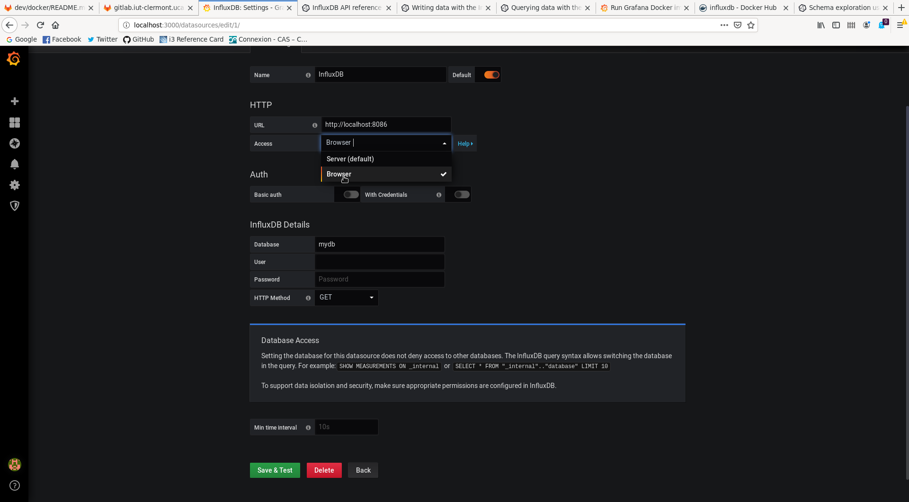
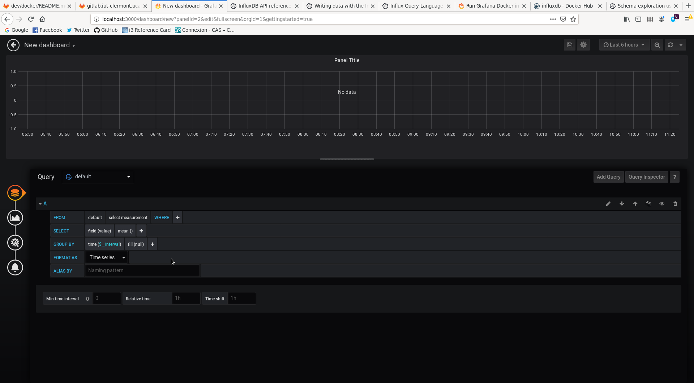

# Influxdb/Grafana/HAL Server Docker-Compose


Contents
--------

- [InfluxDB](#influxdb)
- [Grafana](#grafana)
    - [Web UI](#web-ui)
    - [Data source](#data-source)
    - [InfluxQL](#influxql)
- [InfluxDB API](#influxdb-api)
- [Link it to HAL](#link-it-to-hal)

This docker-compose include hal-server docker-compose.


## Influxdb


You will have to mount a volume data into your host if you want to access the persisted container data

```yaml
    volumes:                                        
      # Data persistency                            
      # sudo mkdir -p /srv/docker/influxdb/data     
      - /srv/docker/influxdb/data:/var/lib/influxdb 
```

By default the path to persisted data is `/srv/docker/influxdb/data`, create it into your host with `sudo mkdir -p /srv/docker/influxdb/data`

Get more information in [docker hub documentation of influxdb](https://hub.docker.com/_/influxdb)


## Grafana


Same as for the influxdb container, if you want to access the persisted container data you'll have to mount a volume in your host.

```yaml
    volumes:
      # Data persistency
      # sudo mkdir -p /srv/docker/grafana/data; chown 472:472 /srv/docker/grafana/data
      - /srv/docker/grafana/data:/var/lib/grafana
```

Create the volume into your host, by default the path is `/srv/docker/grafana/data`, create it into your host with `sudo mkdir -p /srv/docker/grafana/data` and then change the owner of this data by 472. 472 is the default user ID in grafana version >= 5.1 (the default user ID under 5.1 is 104) `chown 472:472 /srv/docker/grafana/data`

Get some more information in [grafana docker documentation](https://grafana.com/docs/grafana/latest/installation/docker/)
Grafana is expose to 3000 port. Once it start, you can access the UI to [localhost:3000](http://localhost:3000)

### WEB UI


This is the login page, by default admin user is defined with the password admin, you can change it after the first connection.

The grafana will take you to the main page, where all the process for a good start is descibe! First step to do is to configure the Data Source, and to configure it with your influxdb container

### Data source


Select Influxdb as the datasource of your grafana.


Depending of your configuration of the docker-compose, if you're passing by a internal docker-compose network for accessing data then keep the default configuration of the **Access** (Server) or if you're passing by the host directly then configure it as **Browser**

Configure the URL where you can access the HTTP API of your influxdb, here it's the default one according to the default configuration of the docker-compose -> http://localhost:8086

And then you can fill in the **InfluxDB Details** as you want ! Here the datasource will get the information of the 'hal_data' database

### InfluxQL

Now that you've config grafana and influxdb, you will be able to collect data and display it to somes dashboard !



All the request of the data will be made by the Influx query langage, [InfluxQL](https://docs.influxdata.com/influxdb/v1.7/query_language/)

## Influxdb API

You can check all the databases presents in influxdb with `curl -G http://localhost:8086/query --data-urlencode "q=SHOW DATABASES"`

If you want to create a database use the influxdb API with `curl -i -XPOST http://localhost:8086/query --data-urlencode "q=CREATE DATABASE hal_data"`.
You can also create data directly with the API : `curl -i -XPOST 'http://localhost:8086/write?db=hal_data' --data-binary 'cpu_load_short,host=server01,region=us-west value=0.64 1434055562000000000'`

For more information about the write endpoint please check [write http endpoint documentation](https://docs.influxdata.com/influxdb/v1.7/tools/api/#write-http-endpoint)

You'll find more about writing data into influxdb database in documentation and a guide in [influxdb API guide](https://docs.influxdata.com/influxdb/v1.7/guides/writing_data/)


## Link it to HAL 

In preparation to link it with HAL, HAL client's will have to push their data into the wanted database in influxdb. Grafana will request the wanted data from influxdb and will able to display it in modern view and dashboard.
The name of the influxdb database is 'hal_data', so in your client you can configure it like that:

```json
"database":
    "connectionString": [
        "http://localhost:8086"
    ]

```
You will have to change the [config.json](../../../README.md#stockage) of your client's
Severals dashboard can be made, severals user can also be made and user-access can be restricted with grafana.
