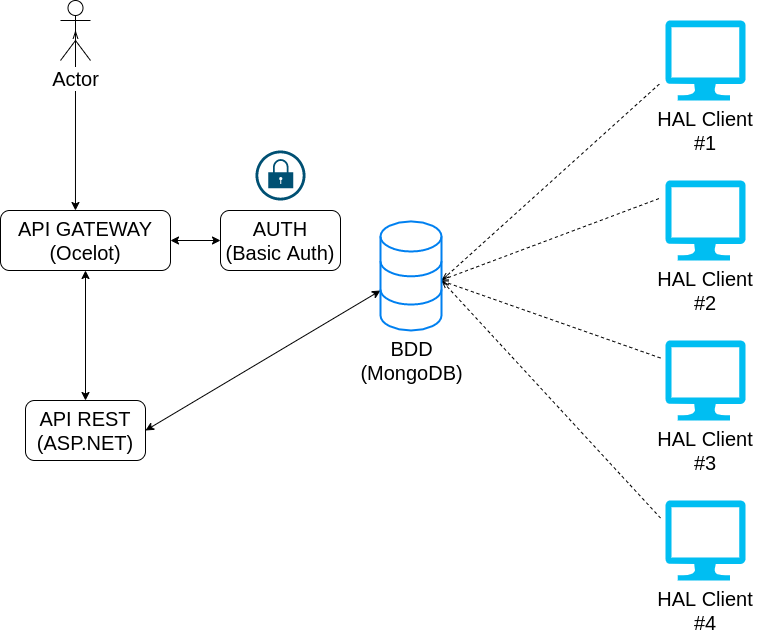
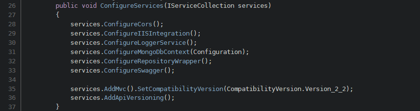
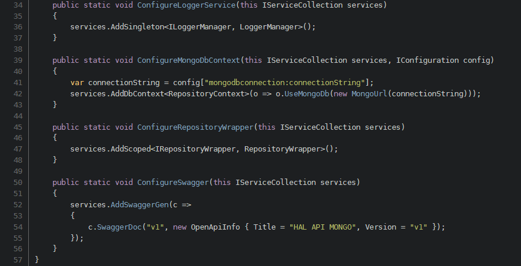
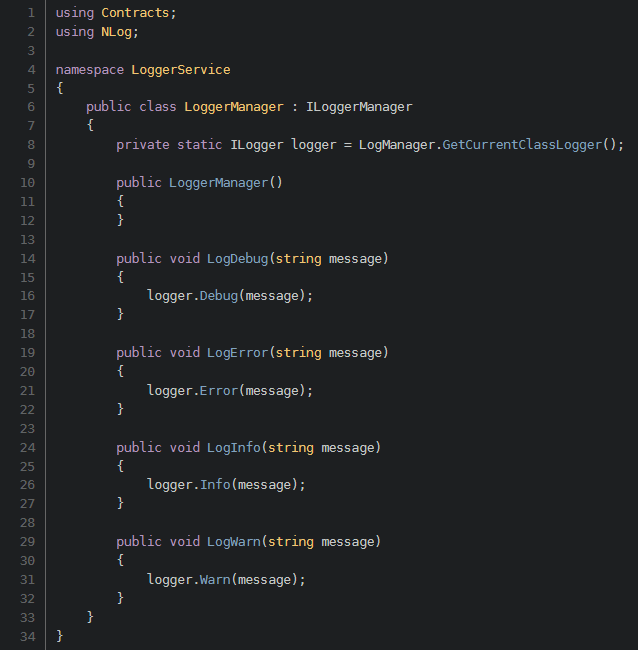
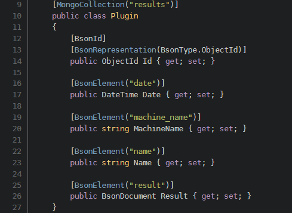
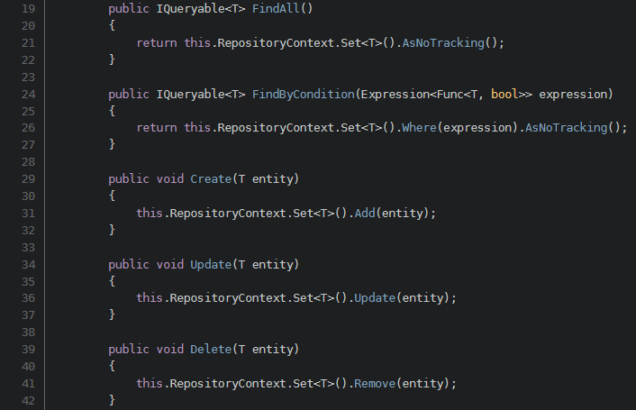
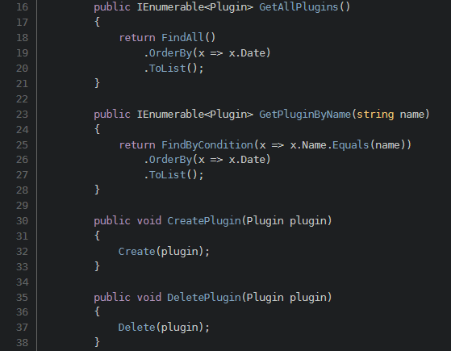
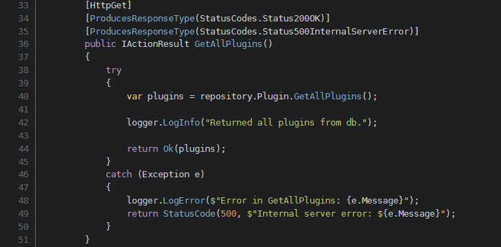
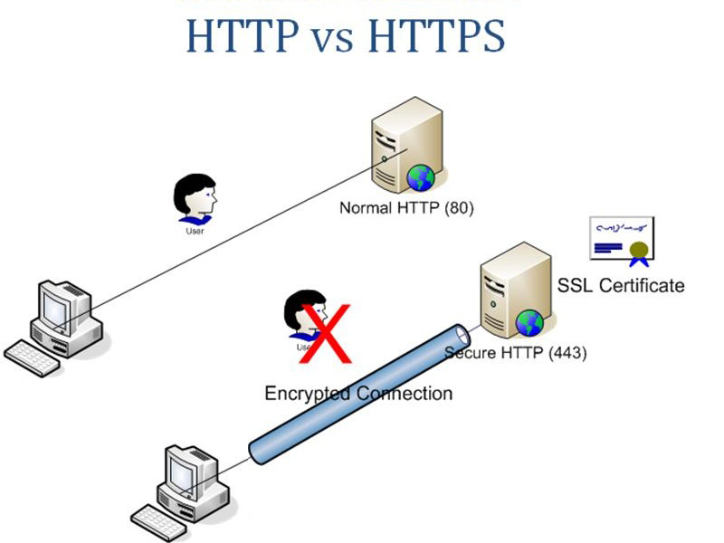

Documentation API
=================

Vous pouvez retrouver ici toute la documentation explicative des choix portées sur l'API REST de HAL.

Contenu
--------
- [Lancement](#lancement)
- [Schema](#schema)
    - [Base de donnée](#base-de-donnée)
    - [API Gateway](#api-gateway)
- [Description des choix](#description-des-choix)
- [Sécurité](#sécurité)
    - [HTTP](#http-les-données-ne-sont-pas-chiffrées)
    - [HTTPS](#https-connexions-chiffrées)
- [Besoins du client et API](#besoins-du-client-et-lapi) 

Lancement
---------

Lancer le docker Mongo: `cd dev/src/api/apirest && docker-compose up -d`

Lancer l'API REST: `dotnet run`

Puis, dans un autre terminal, lancer Ocelot: `cd dev/src/api/apirest_gateway && dotnet run`

Il faudra bien sûr aussi lancer HAL Serveur et le client et le configurer pour avoir les résultats dans la base de donnée.

Pour utiliser les endpoints, il faudra configurer Postman (par exemple) en mode "Basic Auth".

| user | password |
| ------ | ------ |
| admin | admin |

Les endpoints:

| endpoints | fonction |
| ------ | ------ |
| /api/v1/user | renvois la liste des utilisateurs disponibles |
| /api/v1/plugin | renvois les résultats des plugins | 
| /api/v1/plugin/{name} | renvois les résultats des plugins en fonction du nom de ce dernier avec le protocol websocket | 

Pour utiliser les websockets, il est préférable d'utiliser [websocket.org/echo.html](websocket.org/echo.html)

Schema
--------

Notre architecture respecte l'architure classique d'une API REST:
* API Gateway avec Ocelot
* API RESTfull avec ASP.NET Core
* Authentification
* Base de données avec MongoDB

Remise en contexte:
Notre sujet est de créer une application permettant de faire remonter des données au serveur grace à l'execution de plugins, faite par le client. Ces données, sous format JSON, sont envoyées sur un serveur, pour permettre un stockage sur ce dernier, ou bien envoyées dans une base de données (MongoDB, InfluxDB). 
Chaque execution des plugins enverra donc ce résultat s'il est différent du précédent dans la base de donnée, avec d'autres informations comme le nom de la machine, la date...

## Description de l'API

Notre API comporte des logs, une connexion à MongoDB, et Swagger, qui permet d'avoir une documentation automatisée et pouvoir rapidement et efficacement faire des test.

Et l'implémentation:

Notre Logger, utilisant NLog est un outil permettant d'écrire sur la sortie standard, ou dans des fichiers standarisés, plusieurs informations:
* si une opération s'est bien déroulée
* si une opération, au contraire, s'est mal déroulée
* des traces
* des informations de debugs
* ...

Dans l'API, nous avons un seul et unique modèle, celui du résultat du plugin, qui est intégré comme suit:

Ce modèle permet de facilement trier les plugins par différent critéres, et reste très modulaire, puisque le résultat de l'execution de plugin est stocké sous forme de BSONDocument (un dictionnaire clé/valeur), qui est créer automatiquement par le service de MongoDB.

Nous avons aussi un design pattern repository, qui permet de facilement controler son accès à la base de données, sans avoir besoin de recréer une connexion à chaque demande de l'API.

> "A Repository mediates between the domain and data mapping layers, acting like an in-memory domain object collection. Client objects construct query specifications declaratively and submit them to Repository for satisfaction. Objects can be added to and removed from the Repository, as they can from a simple collection of objects, and the mapping code encapsulated by the Repository will carry out the appropriate operations behind the scenes."
> > -- <cite>Cubet Tech</cite>

L'implémentation ensuite de notre Répertoire pour nos plugins:

Finalement, le controleur, qui permet alors de créer des endpoints qui iront récolter divers informations et les retransmettre à l'utilisateur sous format JSON:
Ici, un bout de notre controleur, qui va chercher tous les résultats des plugins dans la base de données:

## Base de donnée

La base de données MongoDB est donc alimentée par les clients. Cette base va stocker tous les résultats sous forme de document, ce qui permet de stocker une grande quantitée de données, mais a comme défaut d'être peu performante dans des reqûetes relationnelles.

## API Gateway

L'API Gateway a été réalisée avec Ocelot, qui permet de facilement manager ses liens et ses api.

> "La passerelle d’API (en anglais, gateway) est le nom générique d'un dispositif permettant de relier deux réseaux informatiques de types différents, par exemple un réseau local et le réseau Internet. Dans le cadre de la discipline de l'API management, cette passerelle a vocation de diriger le trafic des API. Il est possible de regrouper une collection de serveurs de gestion et de serveurs de passerelle pour créer des clusters (grappes de serveurs en français) afin d'équilibrer la charge et d'isoler le trafic. Un cluster a une seule adresse réseau via laquelle vous pouvez accéder à ses fonctions."
> > -- <cite>Wikepedia</cite>

Description des choix
---------------------

Nous avons choisi de faire une API RESTfull et une API utilisant des websockets.

L'API RESTfull est basique. Elle permet de retrouver tous les résultats de tous les plugins, permettant alors de pouvoir maninipuler les différents résultats.

## Sécurité

### HTTP : les données ne sont pas chiffrées
HTTP utilisent un protocole simple de transfert hypertexte, il a été créé au début des années 1990 par Tim Berners-Lee.
HTTP est un système sans état, ce qui signifie qu’il permet de créer des connexions à la demande. Une connexion est sollicitée et le navigateur web envoie la demande au serveur qui répond en ouvrant la page.
En tant que protocole de couche d’application, l’unique objectif de HTTP est d’afficher les informations demandées sans se soucier de la façon dont ces informations se déplacent d’un endroit à un autre. Ca signifie que HTTP peut être intercepté et éventuellement détourné, ce qui rend les informations et leurs destinataires vulnérables.

### HTTPS : connexions chiffrées
HTTPS et HTTP, tous deux sont des protocoles de transfert hypertexte qui permettent à des données web d’être affichées lors une requête. HTTPS est légèrement différent, plus avancé et bien plus sécurisé.
Le protocole HTTPS est une extension de HTTP. Le  "S" signifie "Secure" et il fonctionne grâce au protocole TLS (Transport Layer Security), le successeur du protocole SSL (Secure Sockets Layer), la technologie de sécurité standard pour établir une connexion chiffrée entre un serveur web et un navigateur.
En plus de chiffrer les données transmises entre un serveur et le navigateur, le protocole TLS authentifie également le serveur auquel le client se connecte et protège les données transmises de toute altération.

Besoins du client et l'API
----------------

Par rapport à notre [cahier des charges](../cahierdescharges.pdf) notre API n'est, pour l'instant, d'aucune utilité à notre client. Etant donnée que nous lui fournissons une vue admin depuis l'outil Grafana, le client n'a pas d'intérêt à utiliser l'API afin d'aller chercher les informations qui pourraient lui être nécéssaire dans la base de donnée.

Notre API a, pour le moment, surtout un but éducatif. Cependant, rien n'exclus la prise en main de l'API par le client et, pourquoi pas, l'extension de fonctionnalité dans cette voie la. Si dans le futur, le client veut pouvoir utiliser l'API au détriment de l'outil Grafana, nous aurons déjà une base pour compléter les nouveaux besoins du client.
