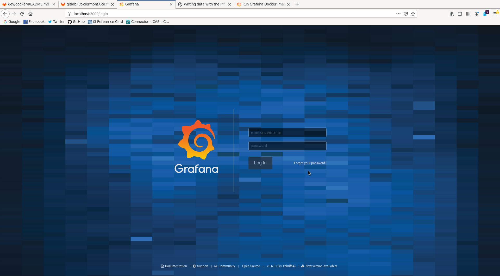
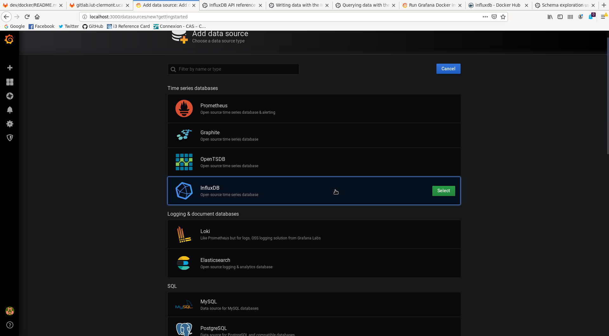

- [Choix Installations](#choix-installations)
  - [Serveur](#serveur)
    - [Docker](#docker)
      - [Exigence](#exigence)
      - [Installation avec Docker](#installation-avec-docker)
    - [Installation Manuelle](#installation-manuelle)
      - [Installation](#installation)
  - [Client](#client)
    - [Installation Manuelle](#installation-manuelle-1)
- [Serveur Docker Documentation](#serveur-docker-documentation)
  - [Docker-Compose du serveur](#docker-compose-du-serveur)
    - [Volumes du serveur](#volumes-du-serveur)
    - [Variables d'environnement](#variables-denvironnement)
  - [Mise à jour du Docker](#mise-à-jour-du-docker)
  - [InfluxDB](#influxdb)
    - [Présentation](#présentation)
    - [Installation InfluxDB](#installation-influxdb)
    - [Volumes InfluxDB](#volumes-influxdb)
    - [InfluxDB API](#influxdb-api)
    - [InfluxQL](#influxql)
    - [Liaison avec HAL](#liaison-avec-hal)
  - [Grafana](#grafana)
    - [Présentation Grafana](#présentation-grafana)
    - [Installation Grafana](#installation-grafana)
    - [Volumes Grafana](#volumes-grafana)
    - [Présentation rapide de l'interface](#présentation-rapide-de-linterface)
      - [Data Source](#data-source)
    - [Grafana et InfluxQL](#grafana-et-influxql)
  - [Tout-en-un](#tout-en-un)
- [Serveur Installation Manuelle](#serveur-installation-manuelle)
  - [Installation Manuelle Linux](#installation-manuelle-linux)
  - [Installation Manuelle Windows](#installation-manuelle-windows)
- [Client Installation](#client-installation)
  - [Installation Manuelle Linux](#installation-manuelle-linux-1)
  - [Installation Manuelle Windows](#installation-manuelle-windows-1)

# Choix Installations

Plusieurs possibilités existe afin d'installer le serveur et le client HAL. Nous recommandons toujours quant c'est possible, l'installation Docker.

## Serveur

### Docker

L'installation Docker du serveur est l'installation recommandé.

#### Exigence

Afin d'installer correctement le serveur vous devrez avoir:

* [Docker](https://docs.docker.com/engine/install/) (v19.0 min)
* [Docker-Compose](https://docs.docker.com/compose/install/) 

#### Installation avec Docker

L'image docker du serveur est présente sur le docker hub de l'IUT: [https://dockerhub.iut-clermont.uca.fr/ui/library/hal_hal-server_dotnet3.1](https://dockerhub.iut-clermont.uca.fr/ui/library/hal_hal-server_dotnet3.1)

Pour plus d'information sur l'installation du docker du serveur se référer à cette [documentation](#docker-compose-du-serveur).

### Installation Manuelle

L'installation manuelle du serveur est possible de plusieurs façon, soit avec un service/daemon ou bien manuellement et non-automatique.

#### Installation 

Des dossiers sont fournis dans l'onglet release du projet Git, dans ces dossiers zippé on retrouve l'éxécutable du serveur, sous linux il suffira de lancer en ligne de commande le serveur avec la commande `./server` (si vous lancez la commande dans le même dossier) ou bien de configurer le daemon fournis dans les dossiers du projet Git (lien vers daemons).

Pour plus d'information se référer à la [documentation](#serveur-installation-manuelle) un peu plus bas.

## Client

Pas d'installation docker disponible pour le Docker pour le moment, nous n'avons pas trouvé ça utile de fournir un lancement conteneurisé pour le client.
Uniquement une installation manuelle est fournis dans la documentation.

### Installation Manuelle

Comme pour le serveur, le dossier zippé du client sera disponible dans l'onglet release du projet Git, dedans on retrouvera l'éxécutable du client, sous linux il suffire de lancer en ligne de commande le serveur avec la commande `./client` (si vous lancez la commande dans le même dossier) ou bien de configurer le daemon fournis dans les dossiers du projet Git (lien vers daemons).

Pour plus d'information se référer à la [documentation](#client-installation) un peu plus bas.


# Serveur Docker Documentation

## Docker-Compose du serveur

Le docker-compose de l'application actuelle est disponible sur [/docker/server/docker-compose.yml](/docker/server/docker-compose.yml).

Le container du serveur, quant à lui, est disponible en publique sur [dockerhub.iut-clermont.uca.fr/ui/library/hal_hal-server_dotnet3.1](https://dockerhub.iut-clermont.uca.fr/ui/library/hal_hal-server_dotnet3.1).

La configuration du docker-compose est comme suit:

```yaml
version: "3.3"
services:
  hal:
    image: dockerhub.iut-clermont.uca.fr:443/hal_hal-server_dotnet3.1:latest
    ports:
      - "11000:11000"
    restart: unless-stopped
    volumes:
          - /data/TMP/hal/results:/data
          - /data/TMP/hal/plugins:/plugins
    environment:
      IP_HAL: "0.0.0.0"
      PORT_HAL: 11000
      MAX_THREADS_HAL: 8
      UPDATE_RATE_HAL: 1000
      SAVE_PATH_HAL: /data
```

### Volumes du serveur

Côté **hôte**, on a deux volumes: `/data/TMP/hal/results` qui correspond au dossier contenant les résultats des plugins exécuté dans les clients de HAL. Vous pouvez le changer comme vous le voulez, cependant le volume côté **conteneur** ne devra pas changer `/data`.

Le second volume: `/data/TMP/hal/plugins` correspond au dossier contenant les plugins à envoyer aux clients de HAL. Vous pouvez également le changer comme vous le voulez, cependant le volume côté **conteneur** ne devra pas être changer `/plugins`.

### Variables d'environnement

Le docker-compose est composé de variables d'environnement, ces variables servent à modifier la configuration du serveur:

- IP_HAL: La variable d'environnement indiquant l'adresse IP du serveur.
- PORT_HAL: La variable d'environnement qui indique le port ou le serveur iras pointer pour les clients et la communication. **/!\ Si cette variables est changé, ne pas oublier de modifier également le port du conteneur dans le docker-compose.yml (champs 'ports' du docker-compose ci-dessus) /!\\**
- MAX_THREADS_HAL: La variable d'environnement qui indique le nombre max de threads utilisé par le serveur HAL.
- UPDATE_RATE_HAL: La variable d'environnement qui indique la fréquence des updates en millisecondes.
- SAVE_PATH_HAL: C'est le chemin où seront sauvegarder les données récoltés par les plugins dans le container du serveur HAL.

## Mise à jour du Docker

Pour mettre à jour le conteneur, il suffit simplement de se placer dans le même dossier que le docker-compose.yml du serveur est de rentrer cette commande: `docker-compose pull`. Cela mettra à jour automatiquement l'image présente dans le docker-compose.yml du dossier ou vous vous trouver.

Ici il mettra à jour l'image: `dockerhub.iut-clermont.uca.fr:443/hal_hal-server_dotnet3.1:latest`

Et pour lancer le serveur via le docker-compose, il suffit de lancer `docker-compose up` ou `docker-compose up -d` pour un lancement en mode démon.

## InfluxDB

InfluxDB est système de gestion de base de donnée orientée données dite 'timeseries', c'est-à-dire qu'il s'agit de base de donnée contenant des données horodatée. Il possède une gestion haute performance et une API permettant le requêtage de donnée au sein même des bases, et ceux grâce à leur langage de requête nommé InfluxQL.

### Présentation

InfluxDB est l'une des solutions proposé pour stocker les données de recolté par HAL, voir la documentation sur les [stockages](/tree/master/#stockage). Notre documentation fournis un ensemble 'ready to go' permettant de lancer le serveur HAL avec Grafana et InfluxDB connecté.

### Installation InfluxDB

Nous n'avons pas fournis de solution d'installation manuelle pour InfluxDB. Ni même de docker-compose indépendant. Cependant vous pouvez créer votre propre docker-compose indépendant pour votre influxDB si vous souhaitez l'installer sur un serveur distant.

Le service d'influxdb au sein du docker-compose se résume comme suit:

```yaml
  influxdb:
    image: influxdb:latest
    restart: unless-stopped
    ports:
      - "8083:8083"
      - "8086:8086"
      - "8090:8090"
    env_file:
      - 'env.influxdb'
    volumes:
      # Data persistency
      # sudo mkdir -p /srv/docker/influxdb/data
      - /srv/docker/influxdb/data:/var/lib/influxdb
```

Le port 8083 d'influxDB correspond à l'interface web administrateur, vous pouvez bien sur redirigé le port hôte vers un autre port souhaité.
Le port 8086 d'influxDB correspond à l'API exposé en HTTP, c'est ce port qui sera utilisé par Grafana afin d'accèder aux données.

NB: Si le conteneur d'influxDB est situé dans le même docker-compose que celui de Grafana, il n'est pas obligatoire d'exposé l'API afin que tout fonctionne correctement, cependant de cette manière vous ne pourrez pas débugger depuis l'exterieur du réseaux interne du docker-compose.

Pour une installation manuelle de InfluxDB, la [documentation](https://docs.influxdata.com/influxdb/v1.8/introduction/install/) d'influxDB est très bien faite et pourras vous aidez à déployer la solution souhaité.

### Volumes InfluxDB

Vous devrez monter un volume sur votre hôte si vous voulez accèder aux données persisté dans le conteneur.

```yaml
    volumes:
      # Data persistency
      # sudo mkdir -p /srv/docker/influxdb/data
      - /srv/docker/influxdb/data:/var/lib/influxdb
```

Par défaut le chemin vers les données persistés côté hôte est: `/srv/docker/influxdb/data` créé le avec la commande `sudo mkdir -p /srv/docker/influxdb/data`.

Plus d'information sur les spécificités du conteneur influxdb sur [la documentation officielle](https://hub.docker.com/_/influxdb).

### InfluxDB API

L'API d'influxDB est essentiel pour la compréhension de Grafana par la suite. En effet, Grafana se servira de cette API afin de communiquer avec la base, il est donc important d'en comprendre les principes.

Pour pouvoir regarder toute les bases de données disponible au sein de la base influxDB: `curl -G http://localhost:8086/query --data-urlencode "q=SHOW DATABASES"`

Bien sur `localhost` est à remplacé par l'adresse de votre serveur influxDB qu'il soit conteneurisé ou non.

Pour créer une base de donnée: `curl -i -XPOST http://localhost:8086/query --data-urlencode "q=CREATE DATABASE hal_data"`

On peut également créer des données à ajouter directement dans les bases que l'on vient de créer, et tout ça en ligne de commande grâce à l'API disponible de InfluxDB:
`curl -i -XPOST 'http://localhost:8086/write?db=hal_data' --data-binary 'cpu_load_short,host=server01,region=us-west value=0.64 1434055562000000000'`

Ici on ajoute une valeur à la colonne `cpu_load_short` dans la base `hal_data` créée précédement.

Pour plus d'information concernant le endpoint `/write`, la documentation se trouve [ici](https://docs.influxdata.com/influxdb/v1.7/tools/api/#write-http-endpoint)

[Ici](https://docs.influxdata.com/influxdb/v1.8/guides/write_data/) vous pouvez retrouver de la documentation et un guide sur l'écriture des données dans les bases de InfluxDB.

Si vous voulez tester HAL en utilisant Grafana et InfluxDB avec l'aide de l'API vous devrez:

- Créer la bdd `hal_data` (`curl -i -XPOST http://localhost:8086/query --data-urlencode "q=CREATE DATABASE hal_data"`)
- Vérifier qu'elle est bien été ajouté (`curl -G http://localhost:8086/query --data-urlencode "q=SHOW DATABASES"`)

### InfluxQL

La documentation officielle du langage créé par InfluxDB se trouve [ici](https://docs.influxdata.com/influxdb/v1.8/query_language/).

Si on reprend notre exemple, avec l'API précédement montré nous avons déjà utiliser du InfluxQL. Donc de cette même manière nous pouvons requeter la base comme ceci:

`curl -G "http://localhost:8086/query?pretty=true" --data-urlencode "db=hal_data" --data-urlencode "q=SELECT "result" FROM "connected_user" WHERE time >= now() - 30m"`

Ce qui nous renverras la colonne 'result' de 'connected_user' dans la base 'hal_data' créé précédement.

Par la suite nous pourrons voir l'utilisation d'influxQL avec Grafana.

### Liaison avec HAL

Les clients de HAL devront pousser les données dans la base de donnée voulu de InfluxDB.

Afin de lier InfluxDB avec HAL il vous faudra modifié le fichier **config\_local.json** du côté du serveur:

```yaml
{
  "server": {
    "ip": "127.0.0.1",
    "port": 11000
  },

  "storage": [
    "influxdb"
  ],

  "database": {
    "connectionString": [
        "http://localhost:8086/"
    ]
  }
}
```

## Grafana

Grafana est un logiciel libre qui permet la visualisation des données. On peut y effectuer des tableaux de bords avancés et également avoir un système d'alerte au sein même de ceux-ci. Il possède aussi une gestion des droits fines pouvant être configuré aisement via son interface web. Il peut être utilisé avec plusieurs Base de donnée mais surtout avec des BDD horodatée comme InfluxDB.

### Présentation Grafana

Grafana est une solution retenue afin d'obtenir une metrologie plus poussé de HAL, il permet d'éffectuer des requêtes à InfluxDB et de pouvoir agencer des tableaux de bords simple d'utilisation. Cependant il faudra avoir une connaissance du langage [InfluxQL](#influxql). Notre documentation fournis un ensemble 'ready to go' permettant de lancer le serveur HAL avec Grafana et InfluxDB connecté.

### Installation Grafana

Nous n'avons pas fournis de solution d'installation manuelle pour Grafana. Ni même de docker-compose indépendant. Cependant vous pouvez créer votre propre docker-compose indépendant pour votre Grafana si vous souhaitez l'installer sur un serveur distant.

/!\ Cependant gardé en tête que la documentation s'appuie sur le fait que les conteneurs sont situé dans le même réseau, si vous souhaitez faire des instances séparées de chacun vous devrez adapté certains éléments de la documentation à votre propre projet /!\

Le service de grafana au sein du docker-compose se résume comme suit:

```yaml
  grafana:
    image: grafana/grafana:latest
    restart: unless-stopped
    ports:
      - "3000:3000"
    user: "0"
    links:
      - influxdb
    volumes:
      # Data persistency
      # sudo mkdir -p /srv/docker/grafana/data; chown 472:472 /srv/docker/grafana/data
      - /srv/docker/grafana/data:/var/lib/grafana
```

Le port 3000 de Grafana correspond à l'interface web.

S'ils se trouvent dans le même docker-compose, grafana est lié au lancement du service influxDB (cette partie est optionnelle si docker-compose différent).

### Volumes Grafana

Vous devrez monter un volume sur votre hôte si vous voulez accèder aux données persisté dans le conteneur.

```yaml
    volumes:
      # Data persistency
      # sudo mkdir -p /srv/docker/grafana/data; chown 472:472 /srv/docker/grafana/data
      - /srv/docker/grafana/data:/var/lib/grafana
```

Créé le volume côté hôte, par défaut le chemin de l'hôte est `/srv/docker/grafana/data`, créé le avec la commande `sudo mkdir -p /srv/docker/grafana/data` puis changé le proprietaire du dossier en 472 avec la commande `chown 472:472 /srv/docker/grafana/data`. 472 est l'utilisateur par défaut dans les versions de grafana >=5.1 (en dessous l'utilisateur par défaut est le 104).

Plus d'information sur la documentation officielle du [docker grafana](https://grafana.com/docs/grafana/latest/installation/docker/).

### Présentation rapide de l'interface



Voici la page de login, par défaut il existe un utilisateur admin avec le mot de pasee admin.

Par la suite Grafana vous redirigeras vers la page principale, ou tout le processus pour un bon début y est présenté. La première étape à faire et de configurer le **Data Source** et de le configurer sur la base influxdb de votre conteneur.

#### Data Source



Selectionné InfluxDB


En fonction de votre configuration du docker-compose, vous pourrez soit passer par un accès Navigateur (Browser) ou Serveur par défaut. Plus d'information sur comment configurer votre data source Grafana vers InfluxDB sur la [documentation officielle](https://grafana.com/docs/grafana/latest/features/datasources/influxdb/)

Ce qu'il y a à retenir pour l'accès c'est si vous mettez Server=l'URL doit être accessible depuis le serveur de Grafana; et si vous mettez Browser=l'URL doit être accessible via le navigateur.

L'URL renseigné dépend donc de votre configuration du docker-compose, cependant s'il est équivalent au notre et que l'influxDB se situe dans le même réseaux que le grafana alors l'url sera -> http://localhost:8086

**InfluxDB Details** dépend la aussi de votre configuration précédente, ici le nom de la base de donné sera celle par défaut, càd `hal_data`.

### Grafana et InfluxQL

Maintenant que tout est configuré il ne reste plus qu'a découvrir l'interface de requetage de Grafana !


On peut maintenant créer une créer une première vue et exposé les données dans un petit tableau dans grafana:


Ici on utilise les résultats du plugins **connected_users**, et bien sur la requête exposé est équivalente à l'appel API : `curl -G "http://localhost:8086/query?pretty=true" --data-urlencode "db=hal_data" --data-urlencode "q=SELECT "result" FROM "connected_user" WHERE time >= now() - 30m"`

## Tout-en-un 

Un docker-compose est disponible afin d'utiliser l'ensemble des solutions avec le serveur HAL; soit Grafana, influxDB et HAL.
La documentation de [Grafana](#grafana) et [influxDB](#influxdb) servent à comprendre comment grafana et influxdb fonctionne au sein du docker-compose. Il suffit de rajouter le serveur HAL afin de le lié à la base et à grafana. Le docker-compose est déjà disponible au sein du projet.

Voici le processus pour tester l'ensemble en **local** par exemple :

- Enlever HAL SERVER du docker-compose (seulement si le test est en local !) et le lancer manuellement.
- Ecrire la bonne configuration pour la base de donnée influxdb dans le config_local.json
- Créer la base de donnée 'hal_data' (`curl -i -XPOST http://localhost:8086/query --data-urlencode "q=CREATE DATABASE hal_data"`)
- Vérifier que la base ai bien été crée (`curl -G http://localhost:8086/query --data-urlencode "q=SHOW DATABASES"`)
- Se connecter à Grafana sur 'localhost:3000' en utilisant l'utilisateur administrateur
- Intérogé la base avec de l'InfluxQL depuis Grafana
- Crée vos propres dashboard
  
# Serveur Installation Manuelle

Plusieurs façons existe afin de lancer manuellement le serveur, bien qu'il soit recommandé de l'utiliser via Docker.

## Installation Manuelle Linux

Il existe un service init.d pour le serveur disponible dans les fichiers du projets.

```yaml
[Unit]
Description=HAL server deamon
After=network-online.target

[Service]
Type=simple
User=hal-server
Group=hal-server
ExecStart=

[Install]
WantedBy=multi-user.target
```

Vous pourrez le modifier à votre guise celon votre utilisation, vous devrez préciser le chemin de l'exécutable via `ExecStart`. Dans le chemin vous devrez exécuter le fichier `server` dans le zip fournis dans la release. Vous préciserez le chemin de la ou vous avez placé le dossier.

Nous vous recommandons de mettre le dossier dans un dossier inaccessible par les utilisateurs et de créer un utilisateur particulier, ici `hal-server`.

Pour lancer le serveur sous linux la commande est `./server`.

## Installation Manuelle Windows

Pour l'installation manuelle windows, même chose à l'exception que pour le moment nous n'avons pas fournis de service Windows (.ini) pour un lancement automatique du service. Vous pouvez cependant le créer pour vous dans la même architecture que le init.d fournis précédement. 

Un dossier .zip est fournis dans l'onglet release du Github, dedans vous trouverez un executable pour windows et vous pourrez le lancer de la même manière que précédement ou bien en double cliquant dessus simplement.

# Client Installation

La seule façon existante d'installer le client et de l'installer manuellement.

## Installation Manuelle Linux

Comme pour le serveur, un deamon init.d est disponible:

```yaml
[Unit]
Description=HAL client deamon
After=network-online.target

[Service]
Type=simple
User=hal-client
Group=hal-client
ExecStart=

[Install]
WantedBy=multi-user.target
```

Vous pouvez le modifier à votre guise, vous devrez spécifié le chemin d'installation que vous aurez choisis pour le client. Vous devrez exécuté l'éxécutable `client` présent dans le zip fournis dans l'onglet release du Github.

Nous vous recommandons de mettre le dossier dans un dossier inaccessible par les utilisateurs et de créer un utilisateur particulier, ici `hal-client`.


Pour lancer le client sous linux la commande est `./client`.

## Installation Manuelle Windows

Pour l'installation manuelle windows, même chose à l'exception que pour le moment nous n'avons pas fournis de service Windows (.ini) pour un lancement automatique du service. Vous pouvez cependant le créer pour vous dans la même architecture que le init.d fournis précédement. 

Un dossier .zip est fournis dans l'onglet release du Github, dedans vous trouverez un executable pour windows et vous pourrez le lancer de la même manière que précédement ou bien en double cliquant dessus simplement.